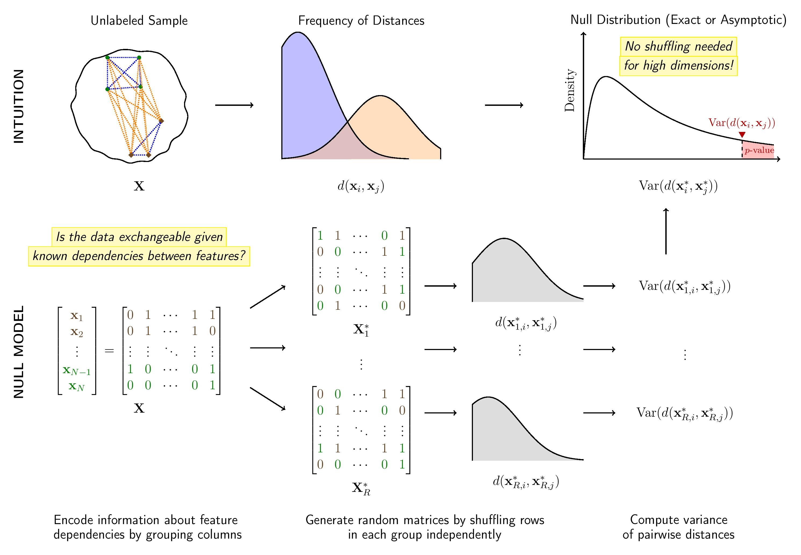

# **flintyR** 

<!-- badges: start -->
[](https://github.com/alanaw1/flintyR/actions/workflows/pkgdown.yaml)
<!-- badges: end -->

This is the homepage of **flintyR**, the R version of the software **flinty** (*Fl*exible and *I*nterpretable *N*on-parametric *T*ests of Exchangeabilit*y*). The Python version is available [here](https://songlab-cal.github.io/flinty). 


<p align="center">
<i>
Bruno is named after a famous statistican who studied exchangeability. Who might that <a href="http://www.brunodefinetti.it/">be</a>?
</i>
</p>

## **What does this package offer?**

**flintyR** provides exact tests of exchangeability in multivariate datasets. 

- It is *non-parametric* (i.e., makes no distributional assumptions of the features), which makes it suitable for settings where the user might prefer not to make distributional assumptions about their data.   
- It is *flexible*, meaning that the practitioner can specify feature dependencies based on their knowledge of the problem. Our tests handle dependent features, should the dependencies satisfy partitionability. See tutorials for details.   
- It is *scalable*, so the user does not have to worry about the sample size $N$ or the number of features $P$ of the data. 
- It is *robust*, meaning that it controls for false positive rate (FPR) and remains powerful in realistic settings including uneven representation of subpopulations, sparsity of discriminative features, and small sample sizes.   

Here is a schema of how **flintyR** works.



## **Installation**

**Using CRAN**

```
install.packages("flintyR")
```

If prompted to compile C/C++/Fortran, enter "Yes" to attempt to install these from sources. 

**Using Tarball**

1. Download the tar ball for **flintyR** from [here](https://github.com/songlab-cal/flinty/tree/main/software/R).
2. Run the following line, changing `FILE_PATH_TO_TAR_BALL`. 

```
devtools::install.packages("FILE_PATH_TO_TAR_BALL",
                 repos = NULL, type = "source")
# Example: devtools::install.packages("/Users/alanaw/Documents/flintyR_0.0.1.tar.gz", repos = NULL, type = "source")
```

## **Example Usage**

The code below demonstrates running our test on a binary matrix. 

```
# library(flintyR)
X <- matrix(nrow = 5, ncol = 10, rbinom(50, 1, 0.5))
getPValue(X) # perform exact test with 5000 permutations
# Output should be larger than 0.05
```

Examples involving real datasets can be found in the tutorials.

## **Tutorials**

We offer several tutorials on using our software.

- Conceptual explorations of exchangeability (see Exchangeability and Homogeneity)
- Application to avoiding risking double dipping (see Introduction)
- Application to single cell genomics 
- Application to World Values Survey 

We love to see our methods and software used across multiple fields, so please reach out to us if you are interested in using them! If there is enough interest, we are happy to include more tutorials.    
