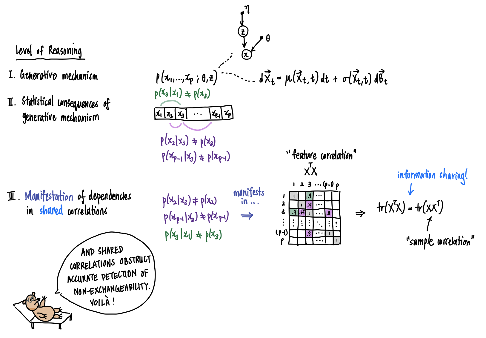

How many ways can a multivariate dataset be heterogeneous? What has exchangeability got to do with it? 

📖 In this vignette, we will

- explore different types of heterogeneities, connecting them to a "working definition" of *statistical homogeneity*, 
- explain how "statistical homogeneity" is better replaced by exchangeability (when trying to detect subpopulations in a given sample)
- investigate, using **flinty**, the tension between sample exchangeability and feature independence

The punchline is that non-exchangeability is a mathematically concrete way to capture our intuition of existence of subpopulations in a given sample, and there are types of statistical heterogeneities that still give rise to exchangeable data. Thus, users of our test should take care in interpreting results obtained from our test, or any other test of structured-ness of data (e.g., the [Tracy-Widom test](https://rdrr.io/bioc/LEA/man/main_tracyWidom.html) of largest singular value).      

# A "Working Definition" of Statistical Homogeneity

Scientists frequently think about homogeneous populations, homogeneous proportions, and homogeneous samples. We run tests of homogeneity on labeled samples (e.g., the $\chi^2$ test). With labeled samples, one could directly formalize homogeneity as "little to no difference with respect to labels." Indeed, the $\chi^2$ test of homogeneity is a test of whether categorical proportions are similar enough between distinctly labeled samples. So are many other tests of homogeneity defined (e.g., [Cochran's test](https://www.itl.nist.gov/div898/software/dataplot/refman1/auxillar/cochvari.htm) for homogeneity of variances between $k$ groups, the [Potthoff-Whittinghill test](https://onlinelibrary.wiley.com/doi/10.1002/9781118445112.stat01756) of homogeneity between two classes). The general test of homogeneity is typically a "test of homogeneity of quantity $x$ with respect to various groups of samples."   

Defining homogeneity without sample labels is less straightforward. Here are some approaches taken by others:

- In Volume 5 of the *Encyclopedia of Statistical Sciences* (second edition [published](https://www.wiley.com/en-gb/Encyclopedia+of+Statistical+Sciences%2C+16+Volume+Set%2C+2nd+Edition-p-9780471150442) in 2006 by Wiley), on p. 3207 the entry "Homogeneity and Tests of Homogeneity" begins with the sentence, "homogeneity refers to sameness or similarity." The rest of the paragraph, and indeed the remainder of the entry, frames homogeneity with respect to a collection of populations. 
- The environmental health book *Radiation-Induced Processes of Adaption: Research by Statistical Modeling* ([published](https://www.springer.com/gp/book/9789400766297) in 2013 by Springer) writes in their Glossary, on p. 173, that homogeneity "relate[s] to the validity of the often convenient assumption that the statistical properties of any one part of an overall dataset are the same as any other part."   

The statistics encyclopedia does not provide any definition of homogeneity of a dataset without labels. This reflects our point in the beginning about how many tests of homogeneity typically require sample labels. On the other hand, the environmental health book describes a formalizable description of homogeneity, namely the clause about statistical properties of any one part looking the same as another. 

Mathematically, the description above says that given a dataset $\{\mathbf{x}_1,\ldots,\mathbf{x}_N\} \subset \mathbb{R}^P$, for it to be homogeneous it should satisfy the following property: for any pair of disjoint subsamples $\mathcal{S}=\{\mathbf{x}_i\}$ and $\mathcal{S}'=\{\mathbf{x}_{i'}\}$, the distributions of the pair of subsamples $F_\mathcal{S}$ and $F_{\mathcal{S}'}$ should not differ by too much: 
\begin{equation}
d(F_\mathcal{S},F_{\mathcal{S}'}) \approx 0,\label{eq:1}
\end{equation}
where $d(\cdot,\cdot)$ is some measure of distance between distributions (e.g., Wasserstein distance or total variation distance).

Suppose we adopt the description above as a working definition of statistical homogeneity. We shall explain why this definition is problematic. 

## A Single Population Doesn't Imply "Statistical Homogeneity"

Let us define a population, for which there are $P$ observable features. These features are statistically independent and identically distributed according to the mixture distribution $\frac{1}{2}N(-2,1) + \frac{1}{2}N(2,1)$. This means that we flip a fair coin to decide whether a feature is drawn from $N(-2,1)$ or from $N(2,1)$.    

For illustrative purposes, let's assume that $P=2$ and draw $N=40$ samples from this distribution. 


```r
## Helper function to draw samples
drawSamples <- function(N)  {
  # create sequence to return
  to_return <- c()
  
  # grow the sequence
  for (n in 1:N) {
    # flip a fair coin
    p <- rbinom(1,1,0.5) 
    
    # if heads...
    if (p == 1) {
      to_return <- c(to_return, rnorm(1, mean = 2, sd = 1)) 
    } else {
      # if tails...
      to_return <- c(to_return, rnorm(1, mean = -2, sd = 1))
    }
  }
  
  # return
  return(to_return)
}

## Generate array
set.seed(2021)
ex_array <- replicate(2, drawSamples(40))

## Annotate positive and negative labels
library(tidyverse)
ex_array <- as.data.frame(ex_array)
ex_array$POSLAB <- (-1 * (ex_array[,1] < 0 & ex_array[,2] < 0) +
                      (ex_array[,1] > 0 & ex_array[,2] > 0)) 

ex_array <- ex_array[order(ex_array$POSLAB),]

## Print
print(ex_array)
#>             V1         V2 POSLAB
#> 6  -1.98622806 -2.2519641     -1
#> 11 -0.42206811 -3.7976124     -1
#> 15 -0.27976384 -1.8282297     -1
#> 17 -1.07187288 -2.1035184     -1
#> 19 -2.88744463 -2.8259549     -1
#> 20 -0.89933137 -1.5167392     -1
#> 24 -3.58347390 -2.1220018     -1
#> 25 -0.46670339 -1.7728245     -1
#> 28 -0.23978627 -1.5496600     -1
#> 29 -2.78119689 -2.6229225     -1
#> 35 -0.80789690 -1.2874858     -1
#> 36 -2.36881809 -1.7987080     -1
#> 37 -1.66402782 -1.8842061     -1
#> 38 -1.57271087 -1.5292104     -1
#> 1  -1.21497757  1.3543091      0
#> 2  -1.65135050  2.3919333      0
#> 3   1.37711402 -0.7146051      0
#> 4   0.07743048 -2.9836134      0
#> 7   2.11479879 -2.2323998      0
#> 9   3.35407495 -2.1500867      0
#> 14 -2.94244327  1.6624908      0
#> 21 -1.94058234  1.2836487      0
#> 22 -0.98055658  1.9465417      0
#> 23 -1.53559759  2.5631673      0
#> 26 -2.08707112  1.4912997      0
#> 27  4.59310821 -2.0767792      0
#> 30  1.96562251 -3.1957732      0
#> 31 -1.53005963  1.4059371      0
#> 32  1.27444279 -4.7007150      0
#> 33  2.60824840 -3.4950350      0
#> 39 -2.07556434  1.5973352      0
#> 40 -3.50559994  0.1976965      0
#> 5   2.16989432  2.1221998      1
#> 8   1.72717482  1.9570100      1
#> 10  3.60447011  0.9606129      1
#> 12  2.13138902  0.6074574      1
#> 13  1.29390807  1.2390690      1
#> 16  3.20811525  2.6332890      1
#> 18  0.54455665  2.5339593      1
#> 34  1.49970920  2.4869767      1
```
Notice we have added positive labels in the third column to annotate whether both features are positive or negative. The example shows that this sample forms two clusters of negative and positive observation pairs, $\mathcal{S}_-$ and $\mathcal{S}_+$. Clearly these disjoint subsamples are far apart, thus rendering the dataset itself not statistically homogeneous under the working definition. See the 2D plot below for a visualization.


```r
## Plot 2D 
ratio <- with(ex_array, diff(range(V1))/diff(range(V2))) # compute ratio to fix make plot square

ggplot(data = ex_array, aes(x = V1, y = V2)) +
  geom_point(aes(colour = factor(POSLAB))) +
  coord_fixed(ratio = ratio) +
  theme_bw() +
  labs(colour = "POSLAB")
```


This observation is true in a more general setting. For $P$ features independently distributed according to the mixture distribution described above, it is always possible to draw a finite sample consisting of $N$ observations, which contains two disjoint subsamples that are far apart. Here is some mathematical intuition. For each observation $\mathbf{x}_n$, let $\mathbf{1}\{\mathbf{x}_n > \mathbf{0}\}$ and $\mathbf{1}\{\mathbf{x}_n < \mathbf{0}\}$ denote, respectively, the event that it is positive and the event that it is negative. A positive observation $\mathbf{x}_n=(x_{n1},\ldots,x_{nP})$ means that each element $x_{nj}$ is positive; likewise for a negative observation. Each component of $\mathbf{x}_n$ is IID according to the mixture distribution that is symmetric about $0$. This implies that each element $x_{nj}$ satisfies $\mathbb{P}(x_{nj}>0) =\mathbb{P}(x_{nj}<0) = 0.5$. Multiplying these probabilities, we see that $\mathbb{P}(\mathbf{x}_n > \mathbf{0})=\mathbb{P}(\mathbf{x}_n < \mathbf{0})=0.5^P$. The indicators are thus Bernoulli distributed with success probability $0.5^P$. Let $K_+$ and $K_-$ denote the number of positive and negative observations contained in a random draw. Since our observations are independently drawn, we see that for any pair of natural numbers $(k_+,k_-)$,
\begin{equation*}
\mathbb{P}(K_+=k_+, K_-=k_-) = {N\choose k_+}{N-k_+ \choose k_-} \left(\frac{1}{2^P}\right)^{k_+ + k_-}.
\end{equation*}
In particular, there is a positive probability that the finite sample drawn at random contains two sets $\mathcal{S}_+, \mathcal{S}_-$ of sizes $k_+$ and $k_-$. These two sets containing positive observations and negative observations exclusively, we see that they are necessarily far apart. 

In fact, it can be shown that for large enough sample sizes, with high probability a finite sample drawn will contain two reasonably large disjoint subsamples $\mathcal{S}_+$ and $\mathcal{S}_-$ that are far apart (i.e., with total variation distance $d_{\text{TV}}(F_{\mathcal{S}_+},F_{\mathcal{S}_-}) =1$). 

<details>
  <summary><b>I like maths. Show me a proof.</b></summary>
     Fantastic. Observe that $K_+$ and $K_-$, defined above, can be written as $K_+=\sum_{n=1}^N \mathbf{1}\{\mathbf{x}_n > \mathbf{0}\}$ and $K_-=\sum_{n=1}^N \mathbf{1}\{\mathbf{x}_n < \mathbf{0}\}$. We already saw that the indicator events $\mathbf{1}\{\cdot\}$ are Bernoulli distributed with success probability $0.5^P$. Thus $K_+$ and $K_-$ are both $\text{Bin}(N,0.5^P)$ distributed.<br/> 
     Bernoulli distributions are subGaussian with subGaussian parameter $\sigma^2=0.25$, regardless of the success probability $p$. Thus $\text{Bin}(N,p)$ distributions are subGaussian with subGaussian parameter $\sigma^2=0.25N$. Being subGaussian implies that a distribution has nice tail bounds. More precisely, Chernoff's bound (see Chapter 2 of [this text](https://www.cambridge.org/core/books/highdimensional-statistics/8A91ECEEC38F46DAB53E9FF8757C7A4E) or the last page of [this course note](https://math.mit.edu/~goemans/18310S15/chernoff-notes.pdf)) implies that $K_+$ and $K_-$ satisfy the following concentration inequalities: for any positive $\epsilon$,
\begin{eqnarray*}
\mathbb{P}(|K_+ - \mathbb{E}[K_+]| > \epsilon) & \leqslant & 2\exp\left(-\frac{2\epsilon^2}{N}\right), \\
\mathbb{P}(|K_- - \mathbb{E}[K_-]| > \epsilon) & \leqslant & 2\exp\left(-\frac{2\epsilon^2}{N}\right).
\end{eqnarray*}
Let's use these concentration inequalities to show that for a finite sample drawn, $K_+$ and $K_-$ will be close to their expectations with high probability. Then as $N$ becomes large enough, we will see that $K_+$ and $K_-$ become reasonably large.<br/> 
     First, by linearity of expectation we have 
\begin{equation*}
\mathbb{E}[K_+] = \mathbb{E}[K_-] = \frac{N}{2^P}.
\end{equation*}
     Next, by the union bound 
\begin{eqnarray*}
\mathbb{P}(|K_+ - \mathbb{E}[K_+]| > \epsilon \vee |K_- - \mathbb{E}[K_-]| > \epsilon) & \leqslant & \mathbb{P}(|K_+ - \mathbb{E}[K_+]| > \epsilon) + \mathbb{P}(|K_- - \mathbb{E}[K_-]| > \epsilon) \\
& \leqslant & 4 \exp\left(-\frac{2\epsilon^2}{N}\right),
\end{eqnarray*}
which implies that the complementary event (the "good" event) satisfies
\begin{equation*}
\mathbb{P}(|K_+ - \mathbb{E}[K_+]| \leqslant \epsilon \wedge |K_- - \mathbb{E}[K_-]| \leqslant \epsilon) \geqslant 1 - 4 \exp\left(-\frac{2\epsilon^2}{N}\right).
\end{equation*}
Now set $\epsilon = N^{0.55}$ and let $N=M \cdot 2^P$ (so that $N$ is some multiple $M$ of $2^P$ where we shall choose $M$ large enough). The last inequality says that with probability at least $1 - 4\exp\left(-2N^{0.1}\right)=1-4\exp\left(-2 \cdot 2^{0.1P} \cdot M^{0.1}\right)$, a random sample contains $K_+$ and $K_-$ positive and negative observations, with
\begin{equation*}
M - 2^{0.55P}\cdot M^{0.55} \leqslant K_+, K_- \leqslant M + 2^{0.55P}\cdot M^{0.55}.
\end{equation*}
This shows that $K_+$ and $K_-$ grow like $M$ with probability $1-4\exp\left(-2 \cdot 2^{0.1P} \cdot M^{0.1}\right)$, a quantity that approaches $1$ as $M\to\infty$. Thus, given fixed $P$, for $M$ large enough (so that the sample size $N$ is also large), we have two reasonably large disjoint subsamples $\mathcal{S}_+$ and $\mathcal{S}_-$ that are far apart. <br/>
     For perspective, set $P=5$ and $M=100$. We draw $N=M\times 2^P = 3200$ observations at random from the population. The argument above says that with probability at least $1-4 \exp\left(-2 \cdot 2^{0.1P} \cdot M^{0.1}\right) = 0.95$, the sample will have $K_+$ and $K_-$ positive and negative samples, with $K_+$ and $K_-$ lying between $M - 2^{0.55P}\cdot M^{0.55}\approx 15.3$ and $M - 2^{0.55P}\cdot M^{0.55}\approx 184.7$.<br/>  
     To finish the argument, we have to quantify "far apart" in terms of some distance computed between the two empirical distributions obtained from the positive and negative sets, $\mathcal{S}_+$ and $\mathcal{S}_-$. We shall use the total variation distance, 
\begin{equation*}
d_\text{TV}(F,F') = \sup\{|\mu_F(A) - \mu_{F'}(A)|: A \subseteq \mathbb{R}^P\}.
\end{equation*}
     The total variation distance is the largest possible difference between the probabilities that the two probability distributions $\mu_F$ and $\mu_F'$ can assign to the same event. It ranges between $0$ and $1$. Now for $\mathcal{S}_+$ and $\mathcal{S}_-$, the corresponding empirical distributions, denoted by $\mu_+$ and $\mu_-$, are fully supported on $\mathbb{R}_+^P$ and $\mathbb{R}_-^P$ respectively. Thus the largest possible difference is at least the difference between the probabilities that $\mu_+$ and $\mu_-$ assign to the set of positive $P$-dimensional reals, which is $1$. Therefore $d_{\text{TV}}(F_{\mathcal{S}_+},F_{\mathcal{S}_-}) \geqslant 1$, which explicitly quantifies that the subsamples are distributionally far apart. (In fact it is equal to $1$, since $d_\text{TV}$ cannot exceed $1$ as was mentioned earlier.)
</details> 
<br/> 
The example above and its generalization show that even if our data originates from a single population, statistical heterogeneity may still arise in finite samples. They demonstrate the need for careful methods to decide whether a finite sample originated from a single population. (Granted, this single population contains $2^P$ clusters, but for large values of $P$ one needs exponentially larger values of $N$ to capture these clusters. This is why we often do not consider clustering a sample into $2^P$ roughly evenly-sized subsamples each containing only a few samples.)  

## Hypothesis Testing and Limitations of Parametric Approaches 

To decide whether a finite sample originated from a single population given that it was sampled at random, we must ask if patterns observed in the finite sample occur due to chance or to the presence of some signal. 

If we have enough information about the population to describe its distribution reasonably accurately (e.g., as a mixture of Gaussians like in the example above), then we could compute the probability of observing the particular finite sample, or at least estimate this probability, say by estimating the distributional parameters using maximum likelihood estimators obtained from the finite sample. We can then reject or accept the null hypothesis that our finite sample was drawn from the particular distribution, at some specified significance level $\alpha$. This is precisely what we are doing when we perform hypothesis testing. 

Unfortunately, in many real scenarios we don't have enough information. There could be

- A lack of reasonable justification for a model choice (e.g., why should we always expect a feature to be modeled well by Gaussians even if it has worked well so far on limited samples?) 
- Insufficient domain knowledge to assume a model (e.g., what kind of distribution should we use to model our data given that we have very little knowledge about its statistical properties?)
- Complex dependencies preventing a clear model choice (e.g., how can we decide between multiple equally complex hierarchical models when they both seem to fit the data well?)

On top of model-driven concerns, there are other technical difficulties.

- For models that have massive numbers of parameters rendering densities extremely small (risking numerical underflow issues), what is a reasonable low-dimensional test statistic based on which to compute the probability of observing our sample? 
- The more complex and expressive a model, the more difficult it is to identify or compute sufficient statistics, which are potential candidates for test statistics especially when estimating distributional parameters is intractable or noisy. 

Given the potential challenge of asserting a parametric model over our finite sample, we need strategies that avoid parametric modelling. One such strategy exploits the exchangeability of finite samples drawn from a population.    

# Exchangeability 

A finite sequence $(\mathbf{x}_1,\ldots,\mathbf{x}_N)$ of random variables is called exchangeable if 
\begin{equation*}
(\mathbf{x}_1,\ldots,\mathbf{x}_N) \overset{D}{=}(\mathbf{x}_{\pi(1)},\ldots,\mathbf{x}_{\pi(N)})
\end{equation*}
for each permutation $\pi$ of $\{1,\ldots,N\}$. This definition is relevant to sampling from a population: a finite sample drawn via random sampling from a large population is exchangeable. 

So how can exchangeability help us avoid parametric modelling while detecting the existence of subpopulations? Let us see a few examples of heterogeneous samples first, relating them to exchangeability.  

## Examples of Exchangeable and Heterogeneous Samples

1. Mixture Distributions and Independent Features
    - We saw this in the example above. 
2. Mixture Distributions and Conditionally Independent Features (I)
    - Let each $\mathbf{x}_n\overset{\text{iid}}{\sim} \frac{1}{2}F_1 + \frac{1}{2}F_2$, where the two source distributions contributing to the mixture are given by $F_1 = \prod_{i=1}^4 N(i^2, 1)$ and $F_2 =\prod_{i=1}^4 N(1/i^2, 1)$. The $\Pi$ notation here means that the $P=4$ features are generated independently according to unit variance Gaussian distributions.     
3. Mixture Distributions and Conditionally Independent Features (II)
    - Let $\mathbf{x}_n\overset{\text{iid}}{\sim} \frac{1}{2}F_1 + \frac{1}{2}F_2$, but now $F_1 = N(1,1) \times N(4,1) \times N(-4,1) \times N(-1,1)$ and $F_2 = N(-1,1) \times N(-4,1) \times N(4,1)\times N(1,1)$. 

Each of these examples generates heterogeneous finite samples, and their finite samples are exchangeable by definition. However, hopefully most readers will agree that only the last two examples represent the existence of subpopulations for which the joint distribution of their features cannot be modeled in a straightforward manner. Indeed, even though the first example generates samples containing $2^P$ clusters, we are able to mathematically describe its features as independent distributions. Additionally, comparing the last two examples reveals that distinct subpopulations can generate a variety of heterogeneities: Example 2 generates samples whose row sums differ by subpopulation, whereas Example 3 generates samples whose row sums look more homogeneous. We provide numerical examples below. 


```r
## Helper functions to generate samples
drawSamplesEx2 <- function(N) {
  to_return <- replicate(N, {p <- rbinom(1,1,0.5)
  if (p == 1) {rnorm(4, mean = c(1,4,9,16))} else { rnorm(4, mean = c(1,1/4,1/9,1/16))}
  })
  return(t(to_return))
}

drawSamplesEx3 <- function(N) {
  to_return <- replicate(N, {p <- rbinom(1,1,0.5)
  if (p == 1) {rnorm(4, mean = c(1,4,-4,-1))} else { rnorm(4, mean = c(-1,-4,4,1))}
  })
  return(t(to_return))
}

## Generate N = 40 observations for each example
ex_2 <- drawSamplesEx2(40) %>% 
  as.data.frame()
ex_2$ROWSUM <- rowSums(ex_2)
ex_3 <- drawSamplesEx3(40) %>% 
  as.data.frame()
ex_3$ROWSUM <- rowSums(ex_3)

## Print
print(ex_2)
#>             V1           V2          V3          V4      ROWSUM
#> 1   1.10068411  2.594680913  9.38260127 16.33230452 29.41027081
#> 2   1.48475660  1.343237643  0.41401952  1.07779944  4.31981320
#> 3   0.81377545  3.031421463  9.50078156 15.38272781 28.72870628
#> 4   1.51258354 -0.155761879  0.46730912 -0.26907087  1.55505991
#> 5  -0.98087962  4.027230179  9.71851167 15.46387139 28.22873362
#> 6   0.05052152  4.446261997  7.71117054 15.84219454 28.05014860
#> 7   0.59358747  5.008695586  9.48745936 15.05228171 30.14202412
#> 8  -0.25403793  1.021043169 -0.80024083 -0.63080537 -0.66404096
#> 9   0.53279877  0.319720620 -0.69743732 -0.03525892  0.11982315
#> 10  1.35541968  4.159138785  9.95539519 15.66035771 31.13031136
#> 11 -0.66652119  1.262734520 -1.50460850  1.85268546  0.94429029
#> 12  1.81878338  0.170349891 -0.37833832  0.91021875  2.52101369
#> 13  0.58194833  1.446715184 -0.14369037  0.45294984  2.33792298
#> 14  1.26115729 -0.742608643 -0.95226989  0.33678466 -0.09693658
#> 15  1.37110398  5.004709994  9.65418086 16.39887569 32.42887052
#> 16  1.27800265  4.147040753  7.80371062 16.09013627 29.31889029
#> 17  1.68299909  4.226607611  8.05642898 15.97404659 29.94008227
#> 18  1.51486548  0.011144777  0.69292968  0.33269527  2.55163521
#> 19 -0.19992547  0.067671152  0.03535128 -0.08128418 -0.17818723
#> 20  0.07594888  0.688599459  0.09901110 -0.58341074  0.28014870
#> 21  0.20860783  3.769535335 11.02650847 17.09418625 32.09883789
#> 22  1.10078634 -0.141752488 -0.29995823 -0.85108128 -0.19200566
#> 23  2.47470011  0.808318503 -0.92924023  0.08050841  2.43428679
#> 24  2.91735175  0.013429884  1.68273446  0.54335007  5.15686617
#> 25  0.42174710  3.981750716  9.23159574 16.86499219 30.50008575
#> 26  0.96871265  4.999043959  9.30031928 15.99480639 31.26288228
#> 27  1.39871518 -0.067974504 -0.30272071 -1.21942516 -0.19140520
#> 28 -0.98570884  1.064365867  1.20936250 -1.37819404 -0.09017451
#> 29  0.90460605  3.690439522 10.88048376 15.95194941 31.42747873
#> 30  0.56565786 -1.623007540 -0.69193341  0.39482209 -1.35446100
#> 31 -0.60581924  5.239595843  9.48406942 17.39158160 31.50942762
#> 32  0.07296961  1.255608690  0.02515366  1.00052486  2.35425682
#> 33  1.42840801  0.246676870 -1.77404647  2.89560466  2.79664307
#> 34  2.43082511  2.858982545  9.89600666 16.08283791 31.26865222
#> 35  0.02845901  3.917522671  6.34691454 17.65469664 27.94759286
#> 36  0.51629898  6.210854157  9.08082445 16.71610646 32.52408405
#> 37  2.63280169  3.370155625  9.60974536 15.34170932 30.95441200
#> 38 -0.56224282  2.012216050  7.50794616 16.25524142 25.21316081
#> 39 -0.41975773  0.005161406 -0.10744747 -1.31323943 -1.83528322
#> 40  1.18694529 -0.444774213 -0.34833190 -0.41250551 -0.01866634
cat("Variance of row sums for ex_2 is ", var(ex_2$ROWSUM), ".", sep = "")
#> Variance of row sums for ex_2 is 218.8347.
print(ex_3)
#>             V1        V2        V3          V4     ROWSUM
#> 1   3.04503083  3.934625 -4.513511  0.99013427  3.4562793
#> 2  -1.54091497 -4.673914  4.680151  1.18671480 -0.3479628
#> 3   0.94311489 -4.390760  4.471871  1.14283428  2.1670596
#> 4   0.99425697  2.958406 -4.325231 -1.60856295 -1.9811318
#> 5   0.12998607  2.537576 -4.338526 -3.04256186 -4.7135258
#> 6  -0.08558911  3.914713 -3.534498 -1.00002890 -0.7054034
#> 7   0.15327102  2.807977 -4.642664 -1.15934744 -2.8407635
#> 8  -2.80955074 -4.779455  2.011673  1.99723557 -3.5800973
#> 9  -1.13217201 -2.582155  2.875181 -0.29546824 -1.1346136
#> 10 -0.45467373 -5.366537  2.883952  1.16247234 -1.7747861
#> 11  0.94723075  1.910360 -5.568118 -0.24966052 -2.9601885
#> 12  0.08967148 -5.402433  4.935231  0.98800737  0.6104769
#> 13  0.10519644  3.679681 -2.082365 -4.04499331 -2.3424809
#> 14  2.13430170  4.510970 -5.497154 -2.11755526 -0.9694374
#> 15  1.47702783 -3.237024  4.787055  1.42857850  4.4556369
#> 16  1.34528408  3.085598 -3.618305 -1.55191817 -0.7393413
#> 17  0.69867536  2.571083 -4.509221 -0.90957855 -2.1490415
#> 18  2.32299459  3.652571 -4.530834 -0.26597688  1.1787542
#> 19  0.52138234  4.126736 -4.692299 -1.82869119 -1.8728723
#> 20  0.55470170  5.177442 -4.077158 -0.44885387  1.2061316
#> 21 -1.07783604 -4.738856  3.350785  0.43886354 -2.0270438
#> 22  1.56085040  4.311423 -2.607969  1.43984314  4.7041474
#> 23 -0.03108365 -4.440290  2.259249  1.63794946 -0.5741759
#> 24 -0.02875327 -5.547164  4.196997  1.83873855  0.4598187
#> 25  0.94184423  3.569038 -2.918003 -0.30211736  1.2907615
#> 26  1.62559235  3.422939 -2.279709  0.63659882  3.4054208
#> 27 -2.02812928 -4.033964  3.881897  1.19822699 -0.9819695
#> 28 -0.79208281 -5.581341  4.862226  2.30930244  0.7981047
#> 29 -0.39321914  4.333431 -4.981819  0.01214888 -1.0294588
#> 30 -0.04508029 -5.063118  5.824255  0.62219514  1.3382521
#> 31 -0.14193175  4.193722 -6.048656 -1.17981779 -3.1766837
#> 32 -0.84622041 -2.928197  2.890542  1.07135746  0.1874821
#> 33  0.76854650  5.138432 -5.152594 -0.13255323  0.6218314
#> 34  2.97458058  5.192781 -4.889379 -1.40013593  1.8778464
#> 35 -1.36202755 -4.522044  2.435318  1.56489719 -1.8838564
#> 36 -0.12343193 -1.768180  5.588877  1.58243381  5.2796990
#> 37 -1.23448220 -5.659886  2.223537  1.50447115 -3.1663604
#> 38  1.77231012  4.726546 -2.452772 -0.87475608  3.1713284
#> 39  1.36924806  4.116374 -5.812461 -0.40007091 -0.7269096
#> 40 -0.59555521 -4.775511  3.764182  2.90738062  1.3004964
cat("Variance of row sums for ex_3 is ", var(ex_3$ROWSUM), ".", sep = "")
#> Variance of row sums for ex_3 is 5.83295.
```

Recall that we want to exploit exchangeability to detect the existence of statistically meaningful populations. The examples above show that exchangeability alone is insufficient for detecting hidden subpopulations from a finite sample. However, observe that a key difference between Examples 2 and 3 and Example 1 lies in feature dependencies. In Examples 2 and 3, the features are *not independent but conditionally independent*, where conditioning is done on the latent distribution membership. This suggests that feature dependency plays a role in *aligning* non-exchangeability with the existence of hidden subpopulations.          

## Tension between Sample Exchangeability and Feature Independence

Consider Examples 1 and 2. To set the stage, suppose we have samples drawn from these two examples. Assume we have neither information about the generative model nor information about the observation labels (i.e., the subpopulation labels are latent). However, we know the samples were drawn from some population at random. With this information let us use **flinty** to detect exchangeability. We consider what happens when additional information is provided successively.  


```r
## Load packages and set directories
library(flintyR)
library(doParallel)
# Register parallel computation
registerDoParallel()
```

**Scenario 1: We do not have information about feature dependencies.** We might assume that the features are independent. This is correct for the array generated by Example 1, but not for Example 2. 


```r
## Compute p-values 
getPValue(as.matrix(ex_array[,1:2])) # Example 1 array
#> [1] 0.7928
getPValue(as.matrix(ex_2[,1:4])) # Example 2 array
#> [1] 0
```

We see that at $\alpha=0.05$ we would consider Example 1's array exchangeable, but not Example 2's array. In other words, the array from Example 2 is not consistent with simultaneously being exchangeable and having independent columns. This demonstrates that treating features as independent when they are in fact not can lead to the appearance of sample non-exchangeability. Thus, sample exchangeability is *contingent on* accounting for feature dependencies.    

**Scenario 2: We have information about feature dependencies.** We know that the features in Example 1 are independent, so nothing changes from the previous scenario when running our test of exchangeability. However, for Example 2 we no longer run the independent features test, but run the dependent features test with all $P=4$ features grouped together as a block. This is because the features cannot be split into two or more independent sets of features.   


```r
## Compute p-value for Example 2 array again
getPValue(as.matrix(ex_2[,1:4]), block_labels = c(1,1,1,1))
#> All blocks are labeled 1, i.e., no independent sets of features detected, so samples are assumed exchangeable.
#> [1] 1
```
Now we see that Example 2's array is considered exchangeable.

By running **flinty** on our example datasets, we have revealed the tension between feature dependencies and sample exchangeability: a sample can appear non-exchangeable without us knowing if it is truly non-exchangeable or actually a consequence of feature dependencies. It is only with information about feature dependencies that we can have confidence in a claim about the sample being non-exchangeable.

<p style="text-align:center;">

</p>
<p align="center">
*Bruno sees how the accurate detection of non-exchangeability depends upon knowledge about the statistical dependencies between features, if not the generative mechanism itself.* 
</p>

<details>
  <summary><b>Is there a mathematical basis for this?</b></summary>
Yes there is, and Bruno's musings have hinted at it. The tension we've described is related to one of the fundamental problems in the analysis of multivariate data: given a $N\times P$ dataset $\mathbf{X}$, how can we tease apart information that is shared between feature correlations and sample correlations? More concretely, to learn something about the samples we require some information or assumptions about the features, and vice-versa. </br>
     How is information shared between feature correlations and sample correlations? This simple fact comes from a basic result in linear algebra: the trace of a matrix is equal to the trace of its transpose. Starting with the dataset $\mathbf{X}$, suppose we doubly standardize it; this means we transform it so that we obtain a version $\overset{\circ}{\mathbf{X}}$ for which the columns and rows of $\overset{\circ}{\mathbf{X}}$ have zero mean and unit variance. Then, $\overset{\circ}{\mathbf{X}}\overset{\circ}{\mathbf{X}}^T$ and $\overset{\circ}{\mathbf{X}}^T\overset{\circ}{\mathbf{X}}$ record the sample and feature covariances respectively. Yet these two covariances share the same eigenvalues, up to inclusion of additional eigenvalues with value $0$. In particular, the sums of eigenvalues, which are the traces, are equal: $\text{tr}\left(\overset{\circ}{\mathbf{X}}\overset{\circ}{\mathbf{X}}^T\right)=\text{tr}\left(\overset{\circ}{\mathbf{X}}^T\overset{\circ}{\mathbf{X}}\right)$. This phenomenon is clearly explained and also explored in the context of testing for sample independence by a [2009 paper](https://projecteuclid.org/journals/annals-of-applied-statistics/volume-3/issue-3/Are-a-set-of-microarrays-independent-of-each-other/10.1214/09-AOAS236.full) of Efron.</br>          
     More broadly, a dataset $\mathbf{X}$ could arise from a multitude of generative processes: one in which observations come from multiple distinct generative processes, each with their own patterns of feature dependencies (sample and feature non-independence), one in which observations come from multiple generative processes that share the same partition of feature dependencies (sample non-independence but shared dependency structure), or one in which observations come from the same generative process (sample independence and shared dependency structure). The first scenario leads to [transposable arrays](https://doi.org/10.1111/j.1467-9868.2011.01027.x), a topic regarding which we leave the reader to pursue at their own interest.    
</details>


