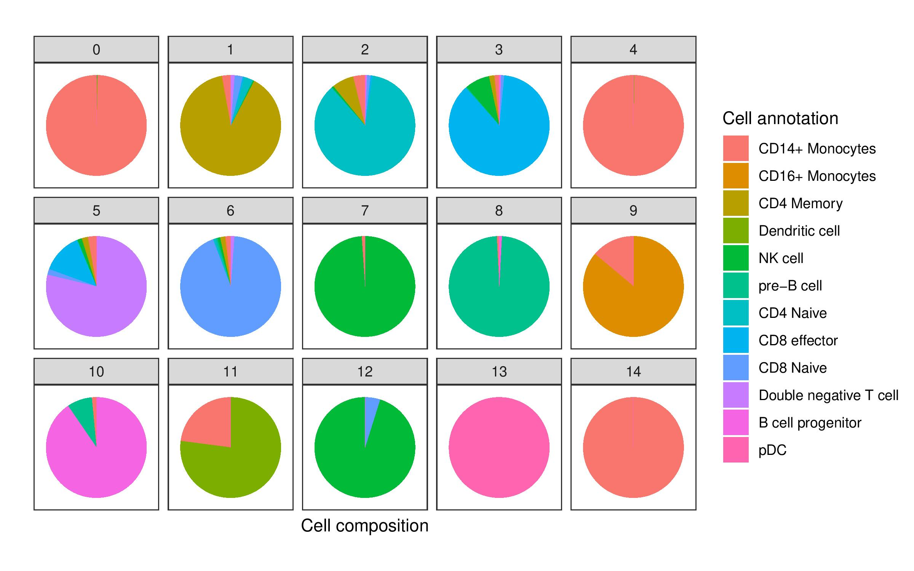

```{r, include = FALSE}
knitr::opts_chunk$set(
  collapse = TRUE,
  comment = "#>"
)
```

In cellular biology, the study of single cells allows biologists to discover mechanisms not detectable by studying only bulk populations of cells. In recent years, advances in sequencing technologies have enabled the quantification of many single cell features (e.g., transcriptome, proteome, metabolome, 3D contact maps), and such datasets have in turn provided new statistical challenges and spurred the development of new probabilistic models ([Lähnemann et al., 2020](https://genomebiology.biomedcentral.com/articles/10.1186/s13059-020-1926-6)). 

Key to discovering mechanisms from single cell data are analyses of heterogeneity between single cell populations. Heterogeneous patterns across multiple biological features reveal biological differences between groups of cells that differ by physical location, temporal factors, or some other biological function, and such differences can subsequently help generate hypotheses relating features to function. Moreover, depending on the question the resolution of the population might differ, for instance at the tissue level, at the cell type level, or even at physical location level among the same cell types.  

<p style="text-align:center;">

</p>
<p align="center">
*Many levels of resolution at which to investigate single cells. Figure is reproduced from [Lähnemann et al. (2020)](https://genomebiology.biomedcentral.com/articles/10.1186/s13059-020-1926-6) under the Creative Commons Attribution (CC-BY) license.* 
</p>

Central to single cell analyses is the clustering of a large population of sampled cells from an experiment. Such clustering often partitions the large population into single cell communities that correspond to some known biological function (e.g., cell type or sampling batch). Once these cell communities are obtained, further analyses can be conducted *on* or *between* identified communities to generate biological hypotheses.

📖 In this vignette, we will:

- show how **flinty** can be applied to detect statistical heterogeneity in single cell clusters detected from scATAC-seq data,
- demonstrate how **flinty** can explain drivers of the detected heterogeneity. 

# Single Cell ATAC-seq Data

We obtain publicly available human peripheral blood mononuclear cell (PBMC) scATAC-seq data from [10X Genomics](https://www.10xgenomics.com/). Data processing requires **Seurat** and its extension, **Signac (v0.2.5)**; both can be installed with Bioconductor.

The code below loads and describes the PBMC data *before* running data processing steps.

```{r pbmc_1, echo = TRUE, eval = TRUE, warning = FALSE, message = FALSE}
## Load packages
library(Seurat)
library(Signac)
library(GenomeInfoDb)
library(hdf5r)
library(tidyverse)
library(dplyr)
library(patchwork)

## Load the original data
counts <- Read10X_h5(filename = "ex_data/scATAC-seq/atac_v1_pbmc_10k_filtered_peak_bc_matrix.h5")
metadata <- read.csv(
  file = "ex_data/scATAC-seq/atac_v1_pbmc_10k_singlecell.csv",
  header = TRUE,
  row.names = 1
)

pbmc <- CreateSeuratObject(
  counts = counts,
  assay = 'peaks',
  project = 'ATAC',
  min.cells = 1,
  meta.data = metadata
)

pbmc <- SetFragments(
  object = pbmc,
  file = "ex_data/scATAC-seq/atac_v1_pbmc_10k_fragments.tsv.gz"
) 

## Show the PBMC object before data processing
pbmc
```

## Data Processing

We perform all steps of data processing up to [non-linear dimension reduction and clustering](https://satijalab.org/signac/articles/pbmc_vignette.html#non-linear-dimension-reduction-and-clustering-1) in this [tutorial](https://satijalab.org/signac/articles/pbmc_vignette.html) provided by the lab of Rahul Satija. 

To summarize the essential steps, we

1. Filter individual cells that fail to satisfy criteria associated with five quality control metrics (nucleosome banding pattern, TSS enrichment score, total number of fragments in peaks, fraction of fragments in peaks and ratio reads in blacklist sites provided by ENCODE);
2. Perform term frequency-inverse document frequency (TF-IDF) normalization and singular value decomposition (SVD) on the TF-IDF normalized matrix; 
3. Cluster the cells using the smart local moving (SLM) algorithm.

We obtain $6954$ cells after Step 1, and Step 3 yielded $15$ clusters altogether, whose sizes are reported below. Note Step 2 is performed to facilitate Step 3, and we still keep the un-normalized data from Step 1 to run our statistical tests. 

```{r pbmc_2, echo = TRUE, eval = TRUE, warning = FALSE, message = FALSE}
## Load summary of clustering, show cluster sizes
load("ex_data/scATAC-seq/scATAC-seq_annotation_cluster.RData")
kableExtra::kable(table(satija.cell.annot.cluster$cluster),
                  col.names = c("Cluster", "Count")) %>%
  kableExtra::kable_styling(position = "center")
```

These clusters can be visualized in 2D space using UMAP. The code to reproduce this plot is provided in the Satija lab vignettes linked above.

<p style="text-align:center;">

</p>

Furthermore, these clusters correspond to myeloid and lymphoid cell populations. One can identify cell types by identifying cluster-defining biological markers using RNA-seq measurements of the same cells; see the Satija lab vignettes [here](https://satijalab.org/seurat/v3.0/pbmc3k_tutorial.html) and [there](https://satijalab.org/seurat/v3.1/atacseq_integration_vignette.html) for details on accomplishing this "feature anchoring" step.

<p style="text-align:center;">

</p>

Before proceeding with our analysis, we note that the $79921$ features per individual cell correspond to physical regions along the human genome, and each feature records the number of reads, more precisely *Tn5cut sites*, mapped by that individual cell to the physical region. These read-based records measure chromatin activity and thus provide information about gene regulation.

# Analysis 

Data processing has provided us with a dataset $\mathbf{X}\in\mathbb{N}^{N\times P}$ consisting of $N=6954$ single cells with $P=79921$ peak reads/counts features recorded per cell. Additionally, $\mathbf{X}$ has been partitioned into $15$ clusters that correspond to certain distinguishable blood cell populations. 

Our first goal is to check whether each cluster of cells looks homogeneous. Indeed, there may be latent stratification or heterogeneities unaccounted for during clustering.

We first binarize $\mathbf{X}=(x_{ij})$ by setting each entry $x_{ij}=1$ if it is positive, and $x_{ij}=0$ otherwise. Such data compression results in loss of information. However, owing to our compression step itself \emph{reducing} variability, if our test reports non-exchangeability on the compressed version, then, all other things being equal, it is the case that the original sample exhibits heterogeneity. (This is a general intuition that may not be true if there exist appropriate statistical models for the original features in the uncompressed version. Hence, we place the caveat "all things being equal." To our knowledge, such a model still does not exist.)

Here is a snapshot of the binarized version of samples from the smallest cluster (Cluster 14).

```{r pbmc_3, echo = TRUE}
## Show Cluster 15 (first six cells and first six features) after binarization
load("ex_data/scATAC-seq/bin_satija_keepzeros_15.RData")
subsetted_data[1:6,1:6]
```

Next, owing to the large number of peak regions ($P=79921$) in our scATAC-seq data, for our analysis below we restrict our features to only those peak regions that lie in Chromosome 1. This restriction reduced the number of features to $P=7824$. Again, we show an example for cells in Cluster 14.

```{r restrict_chr1, echo = TRUE}
## Restricting to Chromosome 1 only
# Get dimension of the array before restriction to peak regions lying in chr1
dim(subsetted_data)
# Restrict peak regions to lie in chr1
subsubsetted_data <- subsetted_data[,grepl("chr1:",colnames(subsetted_data))]
# Get dimension of subarray containing only selected features
dim(subsubsetted_data)
```

## Contingency of Test

One important handle of our test is the specification of dependencies between features. It is unlikely that the features, which are peak reads, are mutually independent of one another, since peak regions within a larger region of open chromatin may have proximal genes that are co-regulated, which drive peak reads themselves to be statistically correlated. Thus we have to account for some dependency structure.

Here, one advantage is that the user has control over what kinds of dependencies to account for, which makes the test interpretable. For example, accounting for dependencies arising from 3D organization of the genome would mean that the test is performed and its result valid, contingent exactly on such 3D organizational dependencies being the only source of dependence between features.

We will in fact account for dependencies arising from 3D organization of the genome. There has been speculation that the 3D structure of the genome is the primary driver of differences in chromatin accessibility. Because chromatin 3D organization is measured by probing physical interaction between non-adjacent genomic loci and such probing in turn is accomplished by chromatin conformation capture (3C) technologies ([Dekker et al., 2002](https://science.sciencemag.org/content/295/5558/1306)), here we shall incorporate Hi-C information ([Lieberman-Aiden et al., 2009](https://science.sciencemag.org/content/326/5950/289)) into our tests. 

Concretely, we use Hi-C data to partition our features into disjoint sets of dependent features (so-called "dependent blocks"), where we group features into the same sets based on whether they belong in the same topologically associating domain (TAD) as identified by Hi-C TAD callers.

## Methods to Call TADs on Hi-C Data

There are more than 20 TAD calling approaches; see [Pal et al. (2019)](https://link.springer.com/article/10.1007/s12551-018-0489-1) for a summary of them. We consider two approaches, **DomainCaller** --- a method proposed by [Dixon et al. (2012)](https://www.nature.com/articles/nature11082) that relies on the directionality index --- and **TopDom** --- a newer approach that scores patterns of contact frequencies and tests these scores for statistical significance under a non-parametric null distribution [Shin et al. (2016)](https://academic.oup.com/nar/article/44/7/e70/2467818). Note both **DomainCaller** and **TopDom** are found reliable in a comprehensive meta-analysis of 22 TAD callers by [Zufferey et al. (2018)](https://genomebiology.biomedcentral.com/articles/10.1186/s13059-018-1596-9).

<details>
  <summary><b>A Important Caveat</b></summary>
    Because the single cell data provided by 10X Genomics is not accompanied by Hi-C contact maps of the same cells, we instead rely on an external Hi-C dataset consisting of human fetal lung fibroblast (IMR90) cells ([Dixon et al., 2012](https://www.nature.com/articles/nature11082)). This introduces one caveat to our analysis: we assume TADs identified from IMR90 cells are approximately identical to TADs in PBMC. Note that there is some evidence suggesting that TADs are reasonably preserved across cell types; see [Sauerwald and Kingsford (2018)](https://academic.oup.com/bioinformatics/article/34/13/i475/5045717) for instance. Careful quantification of the invariance of TADs toward cell type specification is a topic of ongoing research, and we direct the interested reader to, e.g., [Gong et al. (2018)](https://www.nature.com/articles/s41467-018-03017-1), [Krefting et al. (2018)](https://bmcbiol.biomedcentral.com/articles/10.1186/s12915-018-0556-x), and [McArthur and Capra (2021)](https://www.sciencedirect.com/science/article/abs/pii/S000292972100001X). 
</details> 

# Results

## Explanations