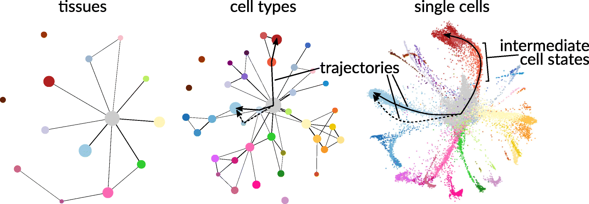

*We are grateful to [Tim Stuart](https://timoast.github.io/), Postdoctoral Researcher at the New York Genome Center, for feedback on accuracy, enhancing accessibility, and improving reproducibility of this vignette.*

In cellular biology, the study of single cells allows biologists to discover mechanisms not detectable by studying only bulk populations of cells. In recent years, advances in sequencing technologies have enabled the quantification of many single cell features (e.g., transcriptome, proteome, metabolome, 3D contact maps), and such datasets have in turn provided new statistical challenges and spurred the development of new probabilistic models ([Lähnemann et al., 2020](https://genomebiology.biomedcentral.com/articles/10.1186/s13059-020-1926-6)). 

Key to discovering mechanisms from single cell data are analyses of heterogeneity between single cell populations. Heterogeneous patterns across multiple biological features reveal biological differences between groups of cells that differ by physical location, temporal factors, or some other biological function, and such differences can subsequently help generate hypotheses relating features to function. Moreover, depending on the question the resolution of the population might differ, for instance at the tissue level, at the cell type level, or even at physical location level among the same cell types.  

<p style="text-align:center;">

</p>
<p align="center">
*Many levels of resolution at which to investigate single cells. Figure reproduced from [Lähnemann et al. (2020)](https://genomebiology.biomedcentral.com/articles/10.1186/s13059-020-1926-6) and [Wolf et al. (2019)](https://genomebiology.biomedcentral.com/articles/10.1186/s13059-019-1663-x) under the Creative Commons Attribution (CC-BY) license.* 
</p>

Central to single cell analyses is the clustering of a large population of sampled cells from an experiment. Such clustering often partitions the large population into single cell communities that correspond to some known biological function (e.g., cell type or sampling batch). Once these cell communities are obtained, further analyses can be conducted *on* or *between* identified communities to generate biological hypotheses.

📖 In this vignette, we will:

- show how **flinty** can be applied to detect statistical heterogeneity in single cell clusters detected from scATAC-seq data,
- demonstrate how **flinty** can explain drivers of the detected heterogeneity. 

# Single Cell ATAC-seq Data

We obtain publicly available human peripheral blood mononuclear cell (PBMC) scATAC-seq data from [10X Genomics](https://www.10xgenomics.com/). Data processing requires **Seurat** and its extension, **Signac (v1.3.0)**; both can be installed with Bioconductor.

The code below loads and describes the PBMC data *before* running data processing steps.


```r
## Install older version of Signac
# devtools::install_version("Signac", version = "0.2.5")

## Load packages
library(Signac)
library(Seurat)
library(EnsDb.Hsapiens.v75)
library(ggplot2)
library(tidyverse)
library(patchwork)

## Load the original data
counts <- Read10X_h5(filename = "ex_data/scATAC-seq/atac_v1_pbmc_10k_filtered_peak_bc_matrix.h5")
metadata <- read.csv(
  file = "ex_data/scATAC-seq/atac_v1_pbmc_10k_singlecell.csv",
  header = TRUE,
  row.names = 1
)

chrom_assay <- CreateChromatinAssay(
  counts = counts,
  sep = c(":", "-"),
  genome = 'hg19',
  fragments = 'ex_data/scATAC-seq/atac_v1_pbmc_10k_fragments.tsv.gz',
  min.cells = 10,
  min.features = 200
)

pbmc <- CreateSeuratObject(
  counts = chrom_assay,
  assay = "peaks",
  meta.data = metadata
)

## Show the PBMC object before data processing
pbmc
#> An object of class Seurat 
#> 87561 features across 8728 samples within 1 assay 
#> Active assay: peaks (87561 features, 0 variable features)
```

## Data Processing

We perform all steps of data processing up to [Non-linear dimension reduction and clustering](https://satijalab.org/signac/articles/pbmc_vignette.html#non-linear-dimension-reduction-and-clustering-1) in this [tutorial](https://satijalab.org/signac/articles/pbmc_vignette.html) provided by the lab of Rahul Satija. 

To summarize the essential steps, we

1. Filter individual cells that fail to satisfy criteria associated with five quality control metrics (nucleosome banding pattern, TSS enrichment score, total number of fragments in peaks, fraction of fragments in peaks and ratio reads in blacklist sites provided by ENCODE);
2. Perform term frequency-inverse document frequency (TF-IDF) normalization on the peak reads matrix;
3. Perform singular value decomposition (SVD) on the TF-IDF normalized matrix to reduce dimensionality; 
4. Cluster the cells using the [smart local moving (SLM)](https://link.springer.com/article/10.1140/epjb/e2013-40829-0) algorithm.

We obtain $7060$ cells after Step 1, and Step 4 yielded $15$ clusters altogether, whose sizes are reported below. Steps 2 and 3 together account for technical noise (e.g., differences in sequencing depth). This step is important for us because we wish to interrogate homogeneity of clusters and to explain any *remaining* sources of heterogeneity in the data *not* owing to technical noise, if there are any.


```r
## Load summary of clustering, show cluster sizes
load("ex_data/scATAC-seq/scATAC-seq_annotation_cluster.RData")
kableExtra::kable(table(combined_metadata$umap_cluster_labels),
                  col.names = c("Cluster", "Count")) %>%
  kableExtra::kable_styling(position = "center")
```

<table class="table" style="margin-left: auto; margin-right: auto;">
 <thead>
  <tr>
   <th style="text-align:left;"> Cluster </th>
   <th style="text-align:right;"> Count </th>
  </tr>
 </thead>
<tbody>
  <tr>
   <td style="text-align:left;"> 0 </td>
   <td style="text-align:right;"> 2530 </td>
  </tr>
  <tr>
   <td style="text-align:left;"> 1 </td>
   <td style="text-align:right;"> 722 </td>
  </tr>
  <tr>
   <td style="text-align:left;"> 2 </td>
   <td style="text-align:right;"> 662 </td>
  </tr>
  <tr>
   <td style="text-align:left;"> 3 </td>
   <td style="text-align:right;"> 587 </td>
  </tr>
  <tr>
   <td style="text-align:left;"> 4 </td>
   <td style="text-align:right;"> 578 </td>
  </tr>
  <tr>
   <td style="text-align:left;"> 5 </td>
   <td style="text-align:right;"> 398 </td>
  </tr>
  <tr>
   <td style="text-align:left;"> 6 </td>
   <td style="text-align:right;"> 357 </td>
  </tr>
  <tr>
   <td style="text-align:left;"> 7 </td>
   <td style="text-align:right;"> 282 </td>
  </tr>
  <tr>
   <td style="text-align:left;"> 8 </td>
   <td style="text-align:right;"> 244 </td>
  </tr>
  <tr>
   <td style="text-align:left;"> 9 </td>
   <td style="text-align:right;"> 234 </td>
  </tr>
  <tr>
   <td style="text-align:left;"> 10 </td>
   <td style="text-align:right;"> 202 </td>
  </tr>
  <tr>
   <td style="text-align:left;"> 11 </td>
   <td style="text-align:right;"> 128 </td>
  </tr>
  <tr>
   <td style="text-align:left;"> 12 </td>
   <td style="text-align:right;"> 60 </td>
  </tr>
  <tr>
   <td style="text-align:left;"> 13 </td>
   <td style="text-align:right;"> 50 </td>
  </tr>
  <tr>
   <td style="text-align:left;"> 14 </td>
   <td style="text-align:right;"> 26 </td>
  </tr>
</tbody>
</table>

These clusters can be visualized in 2D space using UMAP. The code to produce this UMAP plot takes some time to run, so we avoid running it here. Interested readers can find the code in the Satija lab vignettes linked above.

<p style="text-align:center;">

</p>

These clusters correspond to myeloid and lymphoid cell populations. One can identify cell types by identifying cluster-defining biological markers using RNA-seq measurements of the same cells; see the Satija lab vignettes [here](https://satijalab.org/signac/articles/pbmc_vignette.html#integrating-with-scrna-seq-data-1) and [there](https://satijalab.org/seurat/articles/pbmc3k_tutorial.html) for details on accomplishing this "feature anchoring" step.

<p style="text-align:center;">

</p>

Before proceeding with our analysis, we note that the $87561$ features per individual cell correspond to physical regions along the human genome, and each feature records the number of reads, more precisely Tn5cut sites, mapped by that individual cell to the physical region. These read-based records measure chromatin activity and thus provide information about gene regulation.

# Analysis 

Data processing has provided us with a dataset $\mathbf{X}\in\mathbb{R}^{N\times P}$ consisting of $N=7060$ single cells with $P=87561$ TF-IDF normalized peak reads/counts features recorded per cell. Additionally, $\mathbf{X}$ has been partitioned into $15$ clusters that correspond to certain distinguishable blood cell populations. 

Are the clusters homogeneous? How can one verify so? A naïve approach is to assume the normalized peak reads are statistically independent from one another and check for heterogeneity. We do this below for Cluster 11, running the independent features version of our exchangeability test and restricting to peak reads lying in Chromosome 1 to save time. For convenience, we have also saved the clusters generated above, so that we can load them directly and run our test.     


```r
## Show Cluster 11 (first six cells and first six features) 
load("cluster_11_pbmc_data.RData")
# What is the dimension?
dim(extracted_matrix)
#> [1]   128 87561
# Preview first six cells and six normalized features
extracted_matrix[1:6,1:6]
#> 6 x 6 sparse Matrix of class "dgCMatrix"
#>                    chr1-565107-565550 chr1-569174-569639 chr1-713460-714823
#> AAACTGCTCCTATCCG-1                  .                  .           1.746733
#> AAATGCCAGTGAAACT-1                  .                  .           .       
#> AACCAACAGTGTCGGA-1                  .                  .           .       
#> AACCTGATCGCTAGTA-1                  .                  .           .       
#> AACGGGATCTTGTCGC-1                  .                  .           .       
#> AAGATAGGTGCTTACA-1                  .                  .           .       
#>                    chr1-752422-753038 chr1-762106-763359 chr1-779589-780271
#> AAACTGCTCCTATCCG-1                  .                  .                  .
#> AAATGCCAGTGAAACT-1                  .                  .                  .
#> AACCAACAGTGTCGGA-1                  .                  .                  .
#> AACCTGATCGCTAGTA-1                  .                  .                  .
#> AACGGGATCTTGTCGC-1                  .                  .                  .
#> AAGATAGGTGCTTACA-1                  .                  .                  .
# Get peak locations
peak_locs <- colnames(extracted_matrix)
# Extract chromosome number
chr_block_labels <- sapply(peak_locs, function(x) {substring(strsplit(x, split = "-")[[1]][1],4)})
# Extract position of all chr1 chromosomes
last_id <- match("2",chr_block_labels)
last_id <- last_id - 1
# Restrict to peak reads in Chr1
X <- extracted_matrix[,1:last_id]
# Check dimension
dim(X)
#> [1]  128 8555

## Run test of exchangeability
library(flintyR)
getPValue(as.matrix(X), largeP = TRUE) # use large P asymptotics since P is large
#> Warning in max(block_labels): no non-missing arguments to max; returning -Inf
#> Warning in seq_len(length.out - 2L) * by: Recycling array of length 1 in vector-array arithmetic is deprecated.
#>   Use c() or as.vector() instead.
#> Warning in val - grid: Recycling array of length 1 in array-vector arithmetic is deprecated.
#>   Use c() or as.vector() instead.
#> [1] 4.260687e-73
```

The $p$-value above provides evidence that Cluster 11 is non-exchangeable. However, it could be a Type I error arising from wrongly assuming that the features are statistically independent. (In other words, it could also be interpreted as evidence for dependencies between peaks. It could also be interpreted as evidence for *both* cluster heterogeneity and peak dependency.)  

To account for statistical dependencies between peaks, we recall some possible biological factors inducing correlations between peaks.

- Transposase-accessible chromatin peaks map chromatin accessibility, which is typically regulated by transcription factor (TF) binding; see [Tsompana and Buck (2014)](https://epigeneticsandchromatin.biomedcentral.com/articles/10.1186/1756-8935-7-33). Gene regulatory networks that govern the rules of binding induce correlations between peaks, via specific mechanisms through which the associated TFs interact with chromatin. 
- Recent studies have explored how chromosome conformation, or chromatin folding, may implicate gene regulation. Markov models using chromatin-chromatin interaction data (measured by chromosome conformation capture methods like Hi-C) can predict the distributions of activation histone modifications and transcription factors ([Wang et al., 2017](https://doi.org/10.1093/nar/gkx086)), and the precise dynamic relationship can be complicated ([Cortini and Filion, 2018](https://www.nature.com/articles/s41467-018-04130-x)) and also potentially highly contingent on background cellular processes ([Bertero and Fields et al., 2019](https://www.nature.com/articles/s41467-019-09483-5)).        

In our paper and in this vignette, we attempt to investigate the second point by leveraging Hi-C data to group peaks in the scATAC-seq data. Owing to the large number of peak regions ($P=87561$) in our scATAC-seq data, for our analysis we will restrict our features to only those peak regions that lie in Chromosome 1. This restriction reduces the number of features to $P=8555$, as we saw when we ran our test on Cluster 11 earlier.

## Grouping Peaks with Hi-C Data

Before proceeding to integrate Hi-C data with our scATAC-seq data, we provide some background on Hi-C. As described in the second bullet point above, there is evidence suggesting that the 3D structure of the genome plays an important role in determining differences in chromatin accessibility. Chromatin 3D organization is measured by probing physical interaction between non-adjacent genomic loci and such probing in turn is accomplished by chromatin conformation capture (3C) technologies ([Dekker et al., 2002](https://science.sciencemag.org/content/295/5558/1306)). With Hi-C ([Lieberman-Aiden et al., 2009](https://science.sciencemag.org/content/326/5950/289)) being one of the more advanced capturing technologies, we hence use Hi-C data to supervise the grouping of our peaks. The heat map below depicts what a Hi-C interaction map looks like.

<p style="text-align:center;">

</p>
<p align="center">
*Scatterplot of a Hi-C interaction map of Chromosome 14 of a genome sequenced from [lymphoblastoid cells (GM06990)](https://www.coriell.org/0/Sections/Search/Sample_Detail.aspx?Ref=GM06990). Localized darker patches reveal local regions of increased contact. Plot produced using the Bioconductor package [LiebermanAidenHiC2009](https://bioconductor.org/packages/release/data/experiment/html/LiebermanAidenHiC2009.html) with help from [this vignette](https://bioconductor.riken.jp/packages/3.8/data/experiment/vignettes/LiebermanAidenHiC2009/inst/doc/LiebermanAidenHiC2009.pdf).* 
</p>

Concretely, we use Hi-C data to partition our features into disjoint sets of dependent features (so-called "dependent blocks"), where we group features into the same sets based on whether they belong in the same topologically associating domain (TAD) as identified by Hi-C TAD callers.

## Methods to Call TADs on Hi-C Data

There are more than 20 TAD calling approaches; see [Pal et al. (2019)](https://link.springer.com/article/10.1007/s12551-018-0489-1) for a summary of them. We consider two approaches, **DomainCaller** --- a method proposed by [Dixon et al. (2012)](https://www.nature.com/articles/nature11082) that relies on the directionality index --- and **TopDom** --- a newer approach that scores patterns of contact frequencies and tests these scores for statistical significance under a non-parametric null distribution [Shin et al. (2016)](https://academic.oup.com/nar/article/44/7/e70/2467818). Note both **DomainCaller** and **TopDom** are found reliable in a comprehensive meta-analysis of 22 TAD callers by [Zufferey et al. (2018)](https://genomebiology.biomedcentral.com/articles/10.1186/s13059-018-1596-9). (TADs were first described by Dixon and colleagues, so it should come as no surprise that their **DomainCaller** method identifies TADs well.)

We provide a guide to generating TAD boundaries in a separate vignette.

<details>
  <summary><b>A Important Caveat</b></summary>
    Because the single cell data provided by 10X Genomics is not accompanied by Hi-C contact maps of the same cells, we instead rely on an external Hi-C dataset consisting of human fetal lung fibroblast (IfMR90) cells ([Dixon et al., 2012](https://www.nature.com/articles/nature11082)). This introduces one caveat to our analysis: we assume TADs identified from IMR90 cells are approximately identical to TADs in PBMC. Note that there is some evidence suggesting that TADs are reasonably preserved across cell types; see [Sauerwald and Kingsford (2018)](https://academic.oup.com/bioinformatics/article/34/13/i475/5045717) for instance. Careful quantification of the invariance of TADs toward cell type specification is a topic of ongoing research, and we direct the interested reader to recent work, e.g., [Gong et al. (2018)](https://www.nature.com/articles/s41467-018-03017-1), [Krefting et al. (2018)](https://bmcbiol.biomedcentral.com/articles/10.1186/s12915-018-0556-x), and [McArthur and Capra (2021)](https://www.sciencedirect.com/science/article/abs/pii/S000292972100001X). 
</details> 

# Results


```r
## Load packages and set directories
library(Matrix)
library(doParallel)
# Register parallel computation
registerDoParallel()
# Relative directory
rel_dir <- "ex_data/scATAC-seq"
```

## Are Clusters Homogeneous?

Our first goal is to check whether each cluster of cells is homogeneous, even after accounting for potential dependencies between peaks arising from chromosome folding. To accomplish this, we need to group peaks based on whether they lie in the same TAD. We demonstrate how we perform this step, using TAD membership within Chromosome 1 identified by **DomainCaller**. 


```r
## Grouping peaks
# Load libraries
require(HiTC) # install using Bioconductor if not installed
require(HiCDataHumanIMR90) # install using Bioconductor if not installed
data(Dixon2012_IMR90) 

# View TADs identified by DomainCaller
tads_imr90
#> GRanges object with 2338 ranges and 0 metadata columns:
#>            seqnames              ranges strand
#>               <Rle>           <IRanges>  <Rle>
#>      TAD-1     chr1      770138-1290137      *
#>      TAD-2     chr1     1290138-1850140      *
#>      TAD-3     chr1     1850141-2330140      *
#>      TAD-4     chr1     2330141-3610140      *
#>      TAD-5     chr1     3770141-6077413      *
#>        ...      ...                 ...    ...
#>   TAD-2334     chrX 146992309-148552096      *
#>   TAD-2335     chrX 148592096-149929342      *
#>   TAD-2336     chrX 149929343-151969344      *
#>   TAD-2337     chrX 152089345-152746806      *
#>   TAD-2338     chrX 152786807-154946806      *
#>   -------
#>   seqinfo: 23 sequences from an unspecified genome; no seqlengths

# Helper function for classifying each ATAC peak into one of many TADs
getDomainCallerLabels <- function(tads_imr90, peak_locs_2) {
  chr1_tad_locs <- tads_imr90@ranges[which(tads_imr90@seqnames == "chr1"),]
  
  start_pos <- sapply(peak_locs_2, function(x) {strsplit(x, split = "-")[[1]][2]})
  end_pos <- sapply(peak_locs_2, function(x) {strsplit(x, split = "-")[[1]][3]})
  tmp_df <- data.frame(START = start_pos,
                       END = end_pos)
  rownames(tmp_df) <- NULL
  tmp_df$START <- as.numeric(tmp_df$START); tmp_df$END <- as.numeric(tmp_df$END)
  getThisLabel <- function(start_, end_) {
    # Find largest start in chr1_tad_locs that start_ beats
    max_start_ind <- max(which(chr1_tad_locs@start < start_))
    if (is.infinite(max_start_ind)) {
      # Feature has no available block label, set to -99
      message("Peak Region is not contained in any TAD...")
      return(-99)
    } else if ((chr1_tad_locs@start[max_start_ind] + chr1_tad_locs@width[max_start_ind] - 1) <= end_) {
      # Feature is sandwiched between two TADs
      message("Peak Region is sandwiched between two TADs...")
      return(-99)
    } else {
      assertthat::assert_that((chr1_tad_locs@start[max_start_ind] + chr1_tad_locs@width[max_start_ind] - 1) > end_,
                              msg = paste0("end position ", end_," exceeds right end of TAD", chr1_tad_locs@start[max_start_ind  +  1]))
      return(max_start_ind)
    }
  }
  
  # Allocate labels
  tmp_df$LABEL <- mapply(getThisLabel,tmp_df$START, tmp_df$END)
  
  # Return
  return(tmp_df)
}

# Get domainCaller labels
peak_locs_2 <- peak_locs[which(sapply(peak_locs,function(x) {substring(strsplit(x, split = "-")[[1]][1],4)}) == "1")]
each_peaks_tad_membership <- getDomainCallerLabels(tads_imr90, peak_locs_2)

# View each peak's TAD membership
head(each_peaks_tad_membership)
#>    START    END LABEL
#> 1 565107 565550   -99
#> 2 569174 569639   -99
#> 3 713460 714823   -99
#> 4 752422 753038   -99
#> 5 762106 763359   -99
#> 6 779589 780271     1

# How many TADs are there? 
length(unique(each_peaks_tad_membership$LABEL))
#> [1] 233

# Label the peaks of Cluster 11 data
colnames(X) <- each_peaks_tad_membership$LABEL
```

Now that we have our peaks grouped by TAD membership, we can visualize correlations between groups of peaks. Visualization provides us with intuition as to whether peaks within the same group are more correlated with one another than are peaks between different groups. Below, we plot the average correlations between peaks from each pair of groups. We do not compute self-correlations when averaging correlations between peaks from the same group, and drop groups consisting of only a single peak.

<p style="text-align:center;">

</p>
<p align="center">
*Heatmap of average correlations between groups of peaks. When computing average correlations between peaks within the same group (the diagonal elements of the heatmap), self-correlations are removed. The heatmap is generated by the code below.* 
</p>


```r
## Code to generate average correlations between groups of peaks (NOT RUN HERE)
# Obtain Chr1 peaks for entire sample of 7060 cells
#tfidf_norm_matrix <- t(pbmc@assays$peaks@data)
#tfidf_norm_matrix_chr1 <- tfidf_norm_matrix[,1:8555]
#colnames(tfidf_norm_matrix_chr1) <- each_peaks_tad_membership$LABEL
# Delete the non-TAD classified features
#tfidf_norm_matrix_chr1_ <- tfidf_norm_matrix_chr1[,which(test_df_output$LABEL != -99)]
# Rename block labels to be compatible 
#colnames(tfidf_norm_matrix_chr1_) <- as.numeric(as.factor(colnames(tfidf_norm_matrix_chr1_)))
# Order the peaks by groups
#tfidf_norm_matrix_chr1_sub_mat <- tfidf_norm_matrix_chr1_ %>% as.matrix()
#tfidf_norm_matrix_chr1_sub_mat <- tfidf_norm_matrix_chr1_sub_mat[,order(colnames(tfidf_norm_matrix_chr1_sub_mat))]
#all_tads <- unique(colnames(tfidf_norm_matrix_chr1_sub_mat))
# Construct average correlation matrix to plot heatmap
#ave_cor_matrix <- matrix(nrow = length(all_tads), 
#                         ncol = length(all_tads))
#for (i in all_tads) {
#  for (j in all_tads) {
#    # Extract submatrix belonging to TAD i
#    TAD_i <- tfidf_norm_matrix_chr1_sub_mat[,which(colnames(tfidf_norm_matrix_chr1_sub_mat) == i),drop=FALSE]
#    if (i == j) {
#      # Compute the non-matching features only
#      if (ncol(TAD_i) == 1) {
#        x_ij <- 0
#      } else {
#        cor_ii <- cor(TAD_i)
#        cor_ii <- cor_ii - diag(1, nrow(cor_ii), ncol(cor_ii))
#        x_ij <- mean(cor_ii) * nrow(cor_ii)^2 / (nrow(cor_ii)^2 - nrow(cor_ii))
#      }
#    } else {
#      # Extract submatrix belonging to TAD j
#      TAD_j <- tfidf_norm_matrix_chr1_sub_mat[,which(colnames(tfidf_norm_matrix_chr1_sub_mat) == j),drop=FALSE]
#      # Compute average correlation between all features in TAD i and all features in TAD j
#      x_ij <- mean(cor(TAD_i, TAD_j))
#    }
#    # Fill in entry (i,j) of ave_cor_matrix
#    ave_cor_matrix[as.numeric(i),as.numeric(j)] <- x_ij
#  }
#}
# Save average correlation matrix
#write.csv(ave_cor_matrix, file = "ave_cor_matrix.csv")
# Load average correlation matrix
ave_cor_matrix <- read.csv(paste0(rel_dir, "/ave_cor_matrix.csv"), row.names = 1)
# Plot heat map
#col_scheme <- colorRampPalette(c("blue", "white", "red"))(30)
#gplots::heatmap.2(as.matrix(ave_cor_matrix), col=col_scheme, dendrogram='none', Rowv=FALSE, Colv=FALSE, trace='none')
# Compute mean diagonal and off-diagonal correlation values
ave_cor_matrix <- as.matrix(ave_cor_matrix)
mean(diag(ave_cor_matrix))
#> [1] 0.009481952
mean(ave_cor_matrix - diag(ave_cor_matrix)) * nrow(ave_cor_matrix)^2 / (nrow(ave_cor_matrix)^2 - nrow(ave_cor_matrix))
#> [1] -0.00712446
```

The heat map and calculation above suggest that peak-peak correlations within a group are slightly higher than peak-peak correlations between distinct groups. However, average correlations between pairs of groups are all very weak, never exceeding $0.01$ in magnitude.

Take note that TAD grouping is contiguous in nature: peaks physically close to one another are typically grouped together as a TAD, with occasional boundaries breaking the contiguity. This is similar to the grouping of single nucleotide polymorphisms in genetics into contiguous LD blocks, where within-block correlations are empirically higher than between-block correlations.    

We proceed with running our exchangeability test. Since the number of blocks $B=233 - 1 = 232$ (one block corresponds to unclassified peaks) is large, we use the asymptotic version of our test.


```r
## Grouping peaks
# Delete the non-TAD classified features
X_ <- X[,which(each_peaks_tad_membership$LABEL != -99)]
# Remove TADs containing only a single peak
X__ <- X_[,-which(table(colnames(X_)) == 1)]
# Rename block labels to be compatible 
colnames(X__) <- as.numeric(as.factor(colnames(X__)))
# Compute p-value
getPValue(X = as.matrix(X__), block_labels = as.numeric(colnames(X__)), largeP = TRUE)
#> [1] 9.398319e-61
```

We obtain a $p$-value that is essentially $0$. In fact, we found that our test reports zero $p$-values for each cluster. This is true even when we use TAD membership identified by **TopDom**, which we do not show here.

## Investigating Homogeneity of Subclusters

Perhaps the zero $p$-values aren't surprising, given that all clusters, except for Cluster 8, contain multiple cell types. We proceed to analyze subclusters consisting of unique cell types. We run our exchangeability test using the same grouping of peaks by TAD membership. Here, we find that all but three subclusters are non-exchangeable. The three exchangeable subclusters are printed below. 


```r
## Show the three exchangeable subclusters
library(data.table)
domain_caller_results <- data.table::fread(paste0(rel_dir, "/domainCaller_p_value_rm1s_df.txt"))
domain_caller_results %>% subset(P_VALUE < 1 & P_VALUE > 0.05)
#>    CLUSTER  CELL_TYPE SAMPLE_SIZE   P_VALUE
#> 1:       0 CD4 Memory           6 0.2891715
#> 2:       0  CD4 Naive           5 0.1785740
#> 3:       6 CD4 Memory           7 0.4547475
```

To summarize our results thus far, our test provides evidence of heterogeneity, not just in the clusters but also among subclusters consisting of a particular cell type. This is so even after accounting for correlations induced on peak read counts by the 3D structure (TADs) of the genome. Alternatively, if we assert that the clusters and subclusters are exchangeable, then grouping peaks by common TAD membership does not completely capture the complex dependencies between peaks. 

We pursue these two directions of analyses below. 

## What Drives Heterogeneity in Clusters?

Given that all $15$ clusters and most of their subclusters appear heterogeneous even after accounting for chromatin structure-induced dependencies, we shall attempt to explain what drives the heterogeneity. We consider a few *statistical* explanations. Each explanation can potentially be translated into some biological interpretation, and we defer the translation and interpretation to biologists who are more familiar with the subject-matter.

- *Sparse peaks*. The normalized peaks, like the original counts matrix, are highly sparse. For example, when we compute the fraction of zero normalized reads per locus (column feature) for Cluster 11 cells, we find that about $80$% of all loci ($6769$ out of $8555$) have $0.9$ of their normalized reads equal to $0$. Sparsity corresponds to the presence of non-zero values for a select few individuals, and contributes to the overall heterogeneity. This is analogous to the population genetic setting whereby rare variants are localized to a few individuals, typically related by recent ancestry. These individuals would thus form a subclade within the entire sample genealogy, breaking exchangeability.      
- *Row sum variability*. There are two types of heterogeneities, one to do with differences in row sums of a sample and another to do with the patterning of zeros and non-zero values even if row sums are not too far apart. The first type of heterogeneity describes differences in the total value of non-zero peak read counts, across all measured peaks, between individual cells. The second type of heterogeneity describes differences in the configuration of non-zero peak read counts; for instance certain cells may have more non-zero peak read counts at a region while other samples may have more non-zero peak read counts at another region, despite the non-zero peak read counts across the genome being not too different.

Here, we investigate the first point by dropping peaks that based on the fraction of non-zero normalized reads, and defer investigation of the second point to future work.

For example, we consider Cluster 12 ($60$ cells) and focus on the subcluster consisting of $59$ NK cells (one cell is a CD8 Naive). Note this subcluster is non-exchangeable when we run **flinty** at $\alpha=0.05$. We find that a large proportion of peaks is sparse.


```r
## Load and visualize peak statistics
load(file = "cluster_12_pbmc_data.RData")
load(file = "090721_scATAC-seq_annotation_cluster.RData")
# Get peak locations
peak_locs <- colnames(extracted_matrix)
# Extract chromosome number
chr_block_labels <- sapply(peak_locs, function(x) {substring(strsplit(x, split = "-")[[1]][1],4)})
# Extract position of all chr1 chromosomes
last_id <- match("2",chr_block_labels)
last_id <- last_id - 1
X <- extracted_matrix[,1:last_id]
colnames(X) <- each_peaks_tad_membership$LABEL
# Delete the non-TAD classified features
X_ <- X[,which(each_peaks_tad_membership$LABEL != -99)]
X__ <- X_[,-which(table(colnames(X_)) == 1)]
# Filter out the single CD8 naive
cluster_meta <- combined_metadata[which(combined_metadata$umap_cluster_labels==12),]
X_subclust <- X__[rownames(cluster_meta[which(cluster_meta$pred_cell_type == "NK cell"),]),]

# View histogram of feature sparsity (% zero normalized peak reads)
col_sparse_ratio <- apply(as.matrix(X_subclust), 2, function(x) {mean(x == 0)}) 
hist(col_sparse_ratio, main = "Histogram of Peak Sparsity", xlab = "Peak Sparsity")
```


```r
mean((col_sparse_ratio < 0.8))
#> [1] 0.1429788

# View plot of peak variance against peak sparsity
col_variances <- apply(X_subclust,2,var)
plot(x = col_sparse_ratio, y = col_variances, 
     main = "Peak Variance vs Peak Sparsity", 
     xlab = "Peak Sparsity", 
     ylab = "Peak Variance")
```


To see if feature sparsity contributes to heterogeneity, we remove peaks from each group that are too sparse and try running our exchangeability test once more. After several iterations of filtering peaks, we find that additionally removing peaks that have sparsity $\leqslant 0.7$ leads to subcluster exchangeability.


```r
## Run test to explain contribution to heterogeneity
# Remove sparse peaks
X_non_sparse <- as.matrix(X_subclust)[,which(col_sparse_ratio < 0.8 & col_sparse_ratio > 0.7)]
colnames(X_non_sparse) <- as.numeric(as.factor(colnames(X_non_sparse)))

# Check number of independent blocks left after removal
length(unique(colnames(X_non_sparse))) 
#> [1] 148
# large enough for asymptotic test to be used

# Run flinty
getPValue(X_non_sparse, block_labels = as.numeric(colnames(X_non_sparse)), largeP = TRUE)
#> [1] 0.1579093
```

## Under what Dependency Structure of Peaks Are Clusters Exchangeable?

As mentioned earlier, we may also assert that the clusters are exchangeable. If so, we must explain how the features are dependent for each cluster, such that under the dependency structure the cluster is exchangeable or homogeneous. 

Let us consider Cluster 8, which is a community of $244$ pre-B cells. Like our analysis of Cluster 12 above, we start with visualizing some peak statistics, including the distributions of peak sparsity and peak variances.


```r
## Load and visualize peak statistics
load(file = "cluster_8_pbmc_data.RData")
load(file = "090721_scATAC-seq_annotation_cluster.RData")

# Get peak locations
peak_locs <- colnames(extracted_matrix)

# Extract chromosome number
chr_block_labels <- sapply(peak_locs, function(x) {substring(strsplit(x, split = "-")[[1]][1],4)})

# Extract position of all chr1 chromosomes
last_id <- match("2",chr_block_labels)
last_id <- last_id - 1
X <- extracted_matrix[,1:last_id]

# View histogram of feature sparsity (% zero normalized peak reads)
col_sparse_ratio <- apply(as.matrix(X), 2, function(x) {mean(x == 0)}) 
hist(col_sparse_ratio, main = "Histogram of Peak Sparsity", xlab = "Peak Sparsity")
```


```r
mean((col_sparse_ratio < 0.8))
#> [1] 0.1246055

# View plot of peak variance against peak sparsity
col_variances <- apply(X,2,var)
plot(x = col_sparse_ratio, y = col_variances, 
     main = "Peak Variance vs Peak Sparsity", 
     xlab = "Peak Sparsity", 
     ylab = "Peak Variance")
```


We now try to group the peaks based on correlations. We perform hierarchical clustering with Ward linkage and distance matrix constructed from peak-peak correlations. (See p. 21 of [Charrad et al., 2014](https://www.jstatsoft.org/article/view/v061i06) for an explanation of the Ward linkage.)  To choose the optimal number of clusters, which correspond to groups of peaks, we use the Dindex metric. (See p. 14 of [Charrad et al., 2014](https://www.jstatsoft.org/article/view/v061i06) for an explanation of how the Dindex works.) We find that $K=46$ clusters is optimal. Thus, we run our test again, with the peaks now grouped into $46$ blocks based on the clustering approach just described.


```r
# Create distance matrix based on pairwise correlations
peak_cor <- cor(as.matrix(X))
na_sums <- apply(peak_cor,2,function(x){sum(is.na(x))})
na_peaks <- which(na_sums == (dim(peak_cor) - 1))
peak_cor_na_rm <- peak_cor[-na_peaks,-na_peaks]
peak_dist <- as.dist(1 - peak_cor_na_rm) 

# Subset X
X_ <- as.matrix(X)[,!(colnames(X) %in% names(na_peaks))]

# Remove peak correlation matrix
rm(peak_cor)
rm(peak_cor_na_rm)

# Perform hierarchical clustering
peak_tree <- hclust(peak_dist, method="ward.D")
rm(peak_dist)

# Clear garbage
gc()
#>             used   (Mb) gc trigger   (Mb) limit (Mb)  max used   (Mb)
#> Ncells  12172693  650.1   32126820 1715.8         NA  32126820 1715.8
#> Vcells 309536399 2361.6  693332412 5289.8      16384 693332222 5289.8

# Create groups of features
library(dendextend)
peak_dend <- as.dendrogram(peak_tree)

#library(NbClust) # for NbClust to work
# This tuning step takes ~0.5h
#res <- NbClust(data.matrix(X_),
#               distance = "euclidean", 
#               min.nc = 10, 
#               max.nc = 50, 
#               method = "ward.D2",
#               index = "dindex")
#-diff(res$All.index) #  minimized at q = 47, so N_opt = (q - 1) = 46
#which(-diff(res$All.index) == min(-diff(res$All.index)))

# View sizes of each group
clusters <- cutree(peak_dend, k = 46)
table(clusters)
#> clusters
#>    1    2    3    4    5    6    7    8    9   10   11   12   13   14   15   16 
#>   63 5075   49   63   22   34   27   49   58   21   47   21   60   56   31   32 
#>   17   18   19   20   21   22   23   24   25   26   27   28   29   30   31   32 
#>   35  134   48   41   33   21   34   57   48   35   72   40   83   47   41   47 
#>   33   34   35   36   37   38   39   40   41   42   43   44   45   46 
#>   32   30   35   79   47   44   29   31   48   25   17   30   24   36

# Group peaks into clusters
colnames(X_) <- clusters

# Run test of exchangeability
getPValue(X_, block_labels = as.numeric(colnames(X_)), largeP = TRUE)
#> [1] 0.3087334
```

We see that under this grouping of peaks and at level $\alpha=0.05$, the sample is exchangeable. 

To interpret this finding and the associated grouping, we inspect how peaks within the same group are  distributed across Chr 1.


```r
## Inspect with-group peaks' physical location distribution
phys_loc_df <- data.frame(CHR = rep(1, length(clusters)),
                          START = as.numeric(sapply(names(clusters), function(x) {strsplit(x, "-")[[1]][2]})),
                          END = as.numeric(sapply(names(clusters), function(x) {strsplit(x, "-")[[1]][3]})),
                          GROUP = as.numeric(clusters))

# Save files for chromoMap to read 
#write.table(phys_loc_df[,c(1,2,3)], "chr_file.txt", col.names = FALSE, row.names = FALSE)
#write.table(phys_loc_df[,c(1,2,3)], "chr_file.txt", col.names = FALSE, row.names = FALSE)
#phys_loc_df %>% 
#  mutate(ANNO = paste0("Group", GROUP)) %>%
#  select(ANNO, CHR, START, END) %>%
#  write.table(file = "anno_file.txt", col.names = FALSE, row.names = FALSE)

phys_loc_df <- read.table("anno_file.txt", col.names = c("CLUSTER","CHR","START","END"))
phys_loc_df <- phys_loc_df %>% 
  mutate(GROUP =sapply(CLUSTER, function(x) {substring(x, 6) %>% as.numeric()})) %>%
  select(CHR,START,END,GROUP)
#> Error in (function (classes, fdef, mtable) : unable to find an inherited method for function 'select' for signature '"data.frame"'

dat <- apply(phys_loc_df,
      1,
      function(x) data.table(CHR = x["CHR"], BP = x["START"]:x["END"], GROUP = x["GROUP"])
) %>%
  rbindlist()

colors <- colorRampPalette(c("#d7191c", "#fdae61", "#abd9e9", "#2c7bb6"))(46)

ggplot(dat) +
  geom_tile(aes(x = CHR, y = BP, fill = factor(GROUP))) +
  scale_fill_manual(values=colors) +
  theme_bw() +
  scale_x_discrete(labels = 1) +
  xlab("Chromosome 1") +
  ylab("Physical Location (bp)")  +
  ylim(c(565550, 249219853)) +
  labs(fill = "Group") 
```


## Implications for Statistical Modeling of scATAC-seq Peaks

Given the clusters found above do not group neatly by physical location, we interpret this as evidence that "long-range" peak interactions manifesting in correlations in the data, rather than grouping of peaks into contiguous blocks, must be accounted for in the modeling of scATAC-seq peaks, if the cluster is exchangeable or unstratified. There is some biological basis for this: there are almost certainly trans-acting factors that co-regulate multiple peaks across different TADs. Such co-regulation would likely induce dependencies between the peaks that are not captured by the TAD structure alone. 

A broader implication of this analysis is that single cell ATAC peaks cannot simply be grouped into contiguous blocks (with contiguity based on physical location and TAD membership), as we saw earlier. Adequate *statistical modeling* of scATAC-seq data should go beyond simplistic blocking. This is unlike the case in statistical and population genetic models of evolution, where single nucleotide polymorphisms are grouped into blocks based on high within-block linkage disequilibrium (LD).
