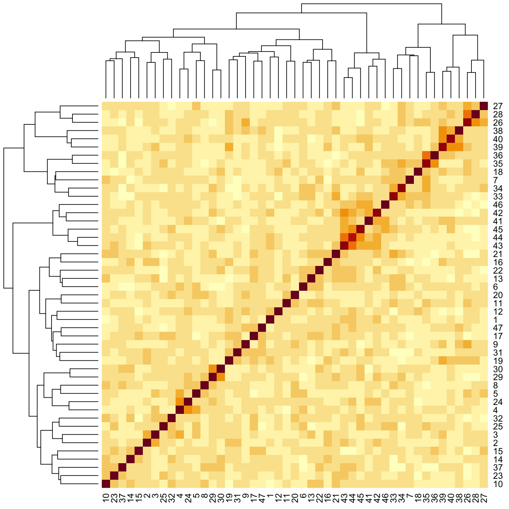

*We are grateful to [Rachel Spicer](https://www.lse.ac.uk/PBS/People/Rachel-Spicer), Post Doctoral Fellow at the London School of Economics and Political Science, for feedback on enhancing accessibility and reproducibility of this vignette.*

In psychological studies, decades of analyses of data originating from primarily Western, Educated, Industrial, Rich and Democratic (WEIRD) societies have contributed to the lack of replicability and generalizability of findings ([Henrich et al., 2010](https://www.cambridge.org/core/journals/behavioral-and-brain-sciences/article/abs/weirdest-people-inthe-world/BF84F7517D56AFF7B7EB58411A554C17)). This has motivated the development of metrics that quantify meaningful cultural differences between societies ([Muthukrishna et al., 2020](https://journals.sagepub.com/doi/full/10.1177/0956797620916782)), which bear on the validity of porting results obtained from analyzing one population over to another different population. 

<p style="text-align:center;">

</p>
<p align="center">
*2D [non-metric multidimensional scaling (NMDS)](https://www.jstor.org/stable/2110441?seq=1) plot generated from a distance matrix summarising how culturally distinct regions are. Each entry of the distance matrix reports the cultural fixation index ($\text{CF}_{ST}$) between two regions. Also shown are distances within the regions, which capture within-nation variation. Figure reproduced from [Muthukrishna et al. (2020)](https://journals.sagepub.com/doi/full/10.1177/0956797620916782), with permission from Michael Muthukrishna.* 
</p>

In contrast to between-society differences that reflect important cultural heterogeneities, differences within putatively singular populations or societies could suggest the presence of distinct communities that reflect meaningful sociological or demographic characteristics. For example, it is known that genealogical communities exist within the United States, and the persistence of homogamous mating in such communities (the determinants of which include, some scholars have suggested, geographic isolation and homophilous sorting by transmitted cultural traits; see [Kalmijn, 1998](https://www.jstor.org/stable/223487?seq=1) and [Feldman and Cavalli-Sforza, 1981](https://press.princeton.edu/books/paperback/9780691082837/cultural-transmission-and-evolution-mpb-16-volume-16)) is manifested in genetic differences ([Han et al., 2017](https://www.nature.com/articles/ncomms14238)). See the Figure below and pay attention to the French Canadians, the Amish, the New Mexicans and the Scandinavians. 
<p style="text-align:center;">

</p>
<p align="center">
*Distribution of ancestral birth locations in North America associated with clusters of individuals. A higher odds ratio (OR) implies that most present-day descendants of individuals from that ancestral birth location belong to the same cluster. Figure reproduced from [Han et al. (2017)](https://www.nature.com/articles/ncomms14238) under the Creative Commons Attribution (CC-BY) license.* 
</p>

📖 In this vignette, we will:

- show how **flinty** can be used to provide evidence for the presence of distinct subpopulations within a single-population sample of individual responses to survey questionnaires,
- demonstrate how **flinty** can generate exchangeable subsamples of individual "culturomes", in the absence of labels on the individuals.

# World Values Survey Data

We obtain publicly available survey questionnaire response data from the [World Values Survey (WVS)](https://www.worldvaluessurvey.org/wvs.jsp). The WVS is a research program aimed at understanding how beliefs, values and norms change over time and across nations globally; it is the largest non-commercial, cross-national, and time-series survey of public attitudes and values around the world. Motivated by the question of within-society differences, we focus on interrogating the cultural homogeneity of Singaporeans based on a representative collection of responses to the WVS questionnaire. To illustrate our method we use data from Wave 6 of the WVS that was released in 2012. (A report by [Mathew, Teo, Tay and Wang, 2021](https://lkyspp.nus.edu.sg/docs/default-source/ips/ips-exchange-series-17.pdf) analyzing Singaporeans from 2020's Wave 7 of the WVS has been published by the Institute of Policy Studies; here is a [press release](https://lkyspp.nus.edu.sg/ips/news/details/attitudes-towards-institutions-politics-and-policies-key-findings-from-the-world-value-survey).)  

To download the WVS data, please read the instructions in our [Github repo](https://github.com/alanaw1/exchangeability_test/tree/main/data-analysis/wvs).

The code below loads and describes the WVS data *before* running data processing steps.


```r
## Load packages
library(tidyverse)

## Load the data
## This file can be downloaded with registration from the WVS website
wvs <- readRDS("ex_data/WVS/F00007762-WV6_Data_R_v20180912.Rds")

# How many samples and how many features?
dim(wvs)
#> [1] 89565   440

# Show the wvs tibble before processing...
wvs
#> # A tibble: 89,565 × 440
#>    V1     V2     V2A    V3    V4    V5    V6    V7    V8    V9    V10   V11   V12  
#>    <labe> <labe> <labe> <lab> <lab> <lab> <lab> <lab> <lab> <lab> <lab> <lab> <lab>
#>  1 6      12     12      1    1     1     1     -2    1     1     2     1     1    
#>  2 6      12     12      2    1     2     3      4    2     2     2     2     2    
#>  3 6      12     12      3    1     3     2      4    2     1     2     2     2    
#>  4 6      12     12      4    1     1     3      4    3     1     2     1     2    
#>  5 6      12     12      5    1     1     1      2    1     1     1     3     2    
#>  6 6      12     12      6    1     2     2      2    4     1     2     1     2    
#>  7 6      12     12      7    1     1     1      1    1     1     2     2     1    
#>  8 6      12     12      8    1     1     1      1    2     2     2     1     2    
#>  9 6      12     12      9    1     1     1      2    2     2     2     2     2    
#> 10 6      12     12     10    1     1     1      2    1     1     1     1     2    
#> # … with 89,555 more rows, and 427 more variables: V13 <labelled>, V14 <labelled>,
#> #   V15 <labelled>, V16 <labelled>, V17 <labelled>, V18 <labelled>,
#> #   V19 <labelled>, V20 <labelled>, V21 <labelled>, V22 <labelled>,
#> #   V23 <labelled>, V24 <labelled>, V25 <labelled>, V26 <labelled>,
#> #   V27 <labelled>, V28 <labelled>, V29 <labelled>, V30 <labelled>,
#> #   V31 <labelled>, V32 <labelled>, V33 <labelled>, V34 <labelled>,
#> #   V35 <labelled>, V36 <labelled>, V37 <labelled>, V38 <labelled>, …

# What doe each feature correspond to? 
feature_anno <- wvs %>% map_chr(~attributes(.)$label) 
head(feature_anno)
#>                                 V1                                 V2 
#>                             "Wave"                     "Country Code" 
#>                                V2A                                 V3 
#> "Country/regions [with split ups]"                 "Interview number" 
#>                                 V4                                 V5 
#>        "Important in life: Family"       "Important in life: Friends"

# What are the labels  (i.e., categories) attached to feature V2?
# [!] Numbers do not indicate the number of samples with that label in the full dataset
attr(wvs$V2, "labels")
#>    Missing; Unknown Not asked in survey      Not applicable           No answer 
#>                  -5                  -4                  -3                  -2 
#>          Don't know             Algeria          Azerbaijan           Argentina 
#>                  -1                  12                  31                  32 
#>           Australia             Armenia              Brazil             Belarus 
#>                  36                  51                  76                 112 
#>               Chile               China              Taiwan            Colombia 
#>                 152                 156                 158                 170 
#>              Cyprus             Ecuador             Estonia             Georgia 
#>                 196                 218                 233                 268 
#>           Palestine             Germany               Ghana               Haiti 
#>                 275                 276                 288                 332 
#>           Hong Kong               India                Iraq               Japan 
#>                 344                 356                 368                 392 
#>          Kazakhstan              Jordan         South Korea              Kuwait 
#>                 398                 400                 410                 414 
#>          Kyrgyzstan             Lebanon               Libya            Malaysia 
#>                 417                 422                 434                 458 
#>              Mexico             Morocco         Netherlands         New Zealand 
#>                 484                 504                 528                 554 
#>             Nigeria            Pakistan                Peru         Philippines 
#>                 566                 586                 604                 608 
#>              Poland               Qatar             Romania              Russia 
#>                 616                 634                 642                 643 
#>              Rwanda           Singapore            Slovenia        South Africa 
#>                 646                 702                 705                 710 
#>            Zimbabwe               Spain              Sweden            Thailand 
#>                 716                 724                 752                 764 
#> Trinidad and Tobago             Tunisia              Turkey             Ukraine 
#>                 780                 788                 792                 804 
#>               Egypt       United States             Uruguay          Uzbekistan 
#>                 818                 840                 858                 860 
#>               Yemen 
#>                 887
```

## Data Processing

We mirror the approach taken by Muthukrishna et al. (2020) --- itself built on the work of [Bell, Richerson and McElreath (2009)](https://doi.org/10.1073/pnas.0903232106) --- to include only a subset of the questions as features and to recode responses to those questions. Concretely, we

1. Remove questions exploring personal idiosyncrasies rather than cultural beliefs (e.g., self-reported state of health is discarded);   
2. Recode by pooling similar responses into a single numerical categorical response (e.g., "very important" and "rather important" are pooled)

We provide scripts accomplishing this in our [Github repo](https://github.com/alanaw1/exchangeability_test/tree/main/data-analysis/wvs).

To facilitate our presentation, we have saved data generated from performing Steps 1 and 2 above. Below is code to load and preview this saved file.


```r
## Load the data 
load("ex_data/WVS/all_MM_num_filtered_recode.RData")

## View data
wv_num_filtered_[1:10, 1:10]
#>         Wave Country Code Country/regions [with split ups] Interview number
#> 1  2010-2013      Algeria                          Algeria                1
#> 2  2010-2013      Algeria                          Algeria                2
#> 3  2010-2013      Algeria                          Algeria                3
#> 4  2010-2013      Algeria                          Algeria                4
#> 5  2010-2013      Algeria                          Algeria                5
#> 6  2010-2013      Algeria                          Algeria                6
#> 7  2010-2013      Algeria                          Algeria                7
#> 8  2010-2013      Algeria                          Algeria                8
#> 9  2010-2013      Algeria                          Algeria                9
#> 10 2010-2013      Algeria                          Algeria               10
#>    Important in life: Family Important in life: Friends
#> 1                          1                          1
#> 2                          1                          1
#> 3                          1                          2
#> 4                          1                          1
#> 5                          1                          1
#> 6                          1                          1
#> 7                          1                          1
#> 8                          1                          1
#> 9                          1                          1
#> 10                         1                          1
#>    Important in life: Leisure time Important in life: Politics
#> 1                                1                          NA
#> 2                                2                           2
#> 3                                1                           2
#> 4                                2                           2
#> 5                                1                           1
#> 6                                1                           1
#> 7                                1                           1
#> 8                                1                           1
#> 9                                1                           1
#> 10                               1                           1
#>    Important in life: Work Important in life: Religion
#> 1                        1                           1
#> 2                        1                           1
#> 3                        1                           1
#> 4                        2                           1
#> 5                        1                           1
#> 6                        2                           1
#> 7                        1                           1
#> 8                        1                           1
#> 9                        1                           1
#> 10                       1                           1
```

We restrict our samples to individuals from Singapore. We obtain a dataset $\mathbf{X}$ with $N=1715$ observations and $51$ categorical features, the first four of which are individual metadata. Thus there are $P=47$ questionnaire response features in total.   


```r
## Select individuals from Singapore
wv_filtered_sg <- wv_num_filtered_ %>% 
  filter(`Country Code` == "Singapore") %>%
  select_if(function(x) !(all(is.na(x)))) %>%
  remove_missing() %>% 
  mutate(across(where(is.numeric), as.factor))
#> Error in filter(., `Country Code` == "Singapore"): object 'Country Code' not found

## View data
wv_filtered_sg[1:10, 1:10]
#>         Wave Country Code Country/regions [with split ups] Interview number
#> 1  2010-2013    Singapore                        Singapore             1001
#> 2  2010-2013    Singapore                        Singapore             1002
#> 3  2010-2013    Singapore                        Singapore             1003
#> 5  2010-2013    Singapore                        Singapore             1005
#> 7  2010-2013    Singapore                        Singapore             1007
#> 8  2010-2013    Singapore                        Singapore             1008
#> 9  2010-2013    Singapore                        Singapore             1009
#> 10 2010-2013    Singapore                        Singapore             1010
#> 11 2010-2013    Singapore                        Singapore             1011
#> 12 2010-2013    Singapore                        Singapore             1012
#>    Important in life: Family Important in life: Friends
#> 1                          1                          1
#> 2                          1                          1
#> 3                          1                          1
#> 5                          1                          1
#> 7                          1                          1
#> 8                          1                          1
#> 9                          1                          1
#> 10                         1                          1
#> 11                         1                          1
#> 12                         1                          1
#>    Important in life: Leisure time Important in life: Politics
#> 1                                1                           2
#> 2                                1                           2
#> 3                                1                           2
#> 5                                1                           1
#> 7                                1                           1
#> 8                                1                           1
#> 9                                1                           1
#> 10                               1                           1
#> 11                               1                           1
#> 12                               1                           2
#>    Important in life: Work Important in life: Religion
#> 1                        1                           2
#> 2                        1                           1
#> 3                        1                           2
#> 5                        1                           1
#> 7                        1                           2
#> 8                        1                           1
#> 9                        1                           2
#> 10                       1                           1
#> 11                       1                           1
#> 12                       1                           1

## Get data dimensions
dim(wv_filtered_sg)
#> [1] 1715   51
```


## One-Hot Encoding

A challenge in measuring distances between categorical survey response variables is to determine which distance correctly measures "how far apart" we believe different pairs of categories should be. For example, should "strongly agree" and "not applicable" be more far apart than "strongly disagree" and "not applicable"? (This always depends on the downstream task; e.g., are distances used for visualization, or for classification, or something else.)  

To compute Hamming distances between categorical variables, we perform *one-hot encoding* of all categorical variables with more than two categories. One-hot encoding means we assume that distances between pairs of categories are agnostic to the categories themselves. For example, consider the variable "Justifiable: Homosexuality". After recoding there are three categories, 0, 1 and 2. Since differences between categories 0, 1 and 2 are assumed not to depend on the choice of categories, we transform 0, 1 and 2 into $3$-bits 100, 010 and 001, so that when computing Hamming distances between the categories, differences between any pair of categories is $1$.   


```r
## Binarize array and generate block delimiters
library(mltools) # for one_hot to work
wv_filtered_sg_bin <- one_hot(data.table::as.data.table(wv_filtered_sg[,5:51]))

## Check dimension of one-hot encoded matrix
dim(wv_filtered_sg_bin)
#> [1] 1715  120

## Get block delimiters 
block_membership <- c()
for (p in 1:47) {
  # Count number of levels in the factor 
  k <- length(levels(wv_filtered_sg[,p+4]))
  
  # Add to block delimiter vector accordingly
  block_membership <- c(block_membership,
                        rep(p,k))
}

block_delims <- c()
for (p in 1:47) {
  # Find position of first occurrence of p in block_membership 
  block_delims <- c(block_delims,match(p,block_membership))
}
```

# Results

## How do responses correlate with one another? 

Before we run any tests of exchangeability, let us visualize, using a heatmap and a dendrogram, how responses to the different survey questions correlate with one another. To generate our dendrogram, we perform hierarchical clustering with Ward linkage and distance matrix constructed from sample-sample correlations. (See p. 21 of [Charrad et al., 2014](https://www.jstatsoft.org/article/view/v061i06) for an explanation of the Ward linkage.) Note that we do not need the one-hot encoded version of $\mathbf{X}$ to accomplish this step.


```r
## Generate a dendrogram
library(dendextend) # for ladderize to work
features_hclust_Euclidean_ward <- hclust(as.dist(1-cor(t(apply(wv_filtered_sg[,-(1:4)], 1, as.numeric)))), 
                                           method = "ward.D")
features_dend <- as.dendrogram(features_hclust_Euclidean_ward) # generate dendrogram for plotting heat map with
```


```r

# Generate heat map to visualize correlations
library(RColorBrewer) # for brewer.pal to work
color.scheme <- rev(brewer.pal(10,"RdBu")) # generate the color scheme to use

heatmap(cor(t(apply(wv_filtered_sg[,-(1:4)], 1, as.numeric))),
        Rowv = ladderize(features_dend),
        Colv = ladderize(features_dend),
        cexRow = 0.3,
        cexCol = 0.3,
        margins = c(2,2))
```


Even though we have to zoom into the figure for details, we already see that there are groups of features that are more correlated with one another. Here are three examples:

- Group 1: Responses to Question IDs 38 to 46 (rightmost clade of dendrogram)
- Group 2: Responses to Question IDs 6, 33, 34, 35, and 36 (next rightmost clade after Group 1 clade)
- Group 3: Responses to Question IDs 4, 5, and 24 (a very small clade left of Group 2 clade)

The questions corresponding to the IDs are printed below.   


```r
## Print table of responses with IDs
kableExtra::kable(data.frame(ID = 1:length(rownames(t(wv_filtered_sg[,-(1:4)]))),
                             Question = rownames(t(wv_filtered_sg[,-(1:4)]))))
```

<table>
 <thead>
  <tr>
   <th style="text-align:right;"> ID </th>
   <th style="text-align:left;"> Question </th>
  </tr>
 </thead>
<tbody>
  <tr>
   <td style="text-align:right;"> 1 </td>
   <td style="text-align:left;"> Important in life: Family </td>
  </tr>
  <tr>
   <td style="text-align:right;"> 2 </td>
   <td style="text-align:left;"> Important in life: Friends </td>
  </tr>
  <tr>
   <td style="text-align:right;"> 3 </td>
   <td style="text-align:left;"> Important in life: Leisure time </td>
  </tr>
  <tr>
   <td style="text-align:right;"> 4 </td>
   <td style="text-align:left;"> Important in life: Politics </td>
  </tr>
  <tr>
   <td style="text-align:right;"> 5 </td>
   <td style="text-align:left;"> Important in life: Work </td>
  </tr>
  <tr>
   <td style="text-align:right;"> 6 </td>
   <td style="text-align:left;"> Important in life: Religion </td>
  </tr>
  <tr>
   <td style="text-align:right;"> 7 </td>
   <td style="text-align:left;"> Important child qualities: independence </td>
  </tr>
  <tr>
   <td style="text-align:right;"> 8 </td>
   <td style="text-align:left;"> Important child qualities: Hard work </td>
  </tr>
  <tr>
   <td style="text-align:right;"> 9 </td>
   <td style="text-align:left;"> Important child qualities: Feeling of responsibility </td>
  </tr>
  <tr>
   <td style="text-align:right;"> 10 </td>
   <td style="text-align:left;"> Important child qualities: Imagination </td>
  </tr>
  <tr>
   <td style="text-align:right;"> 11 </td>
   <td style="text-align:left;"> Important child qualities: Tolerance and respect for other people </td>
  </tr>
  <tr>
   <td style="text-align:right;"> 12 </td>
   <td style="text-align:left;"> Important child qualities: Thrift saving money and things </td>
  </tr>
  <tr>
   <td style="text-align:right;"> 13 </td>
   <td style="text-align:left;"> Important child qualities: Religious faith </td>
  </tr>
  <tr>
   <td style="text-align:right;"> 14 </td>
   <td style="text-align:left;"> Important child qualities: Unselfishness </td>
  </tr>
  <tr>
   <td style="text-align:right;"> 15 </td>
   <td style="text-align:left;"> Important child qualities: Obedience </td>
  </tr>
  <tr>
   <td style="text-align:right;"> 16 </td>
   <td style="text-align:left;"> Most people can be trusted </td>
  </tr>
  <tr>
   <td style="text-align:right;"> 17 </td>
   <td style="text-align:left;"> On the whole, men make better political leaders than women do </td>
  </tr>
  <tr>
   <td style="text-align:right;"> 18 </td>
   <td style="text-align:left;"> Aims of country: first choice </td>
  </tr>
  <tr>
   <td style="text-align:right;"> 19 </td>
   <td style="text-align:left;"> Aims of respondent: first choice </td>
  </tr>
  <tr>
   <td style="text-align:right;"> 20 </td>
   <td style="text-align:left;"> Most important: first choice </td>
  </tr>
  <tr>
   <td style="text-align:right;"> 21 </td>
   <td style="text-align:left;"> Future changes: Less importance placed on work in our lives </td>
  </tr>
  <tr>
   <td style="text-align:right;"> 22 </td>
   <td style="text-align:left;"> Future changes: Greater respect for authority </td>
  </tr>
  <tr>
   <td style="text-align:right;"> 23 </td>
   <td style="text-align:left;"> Protecting environment vs. Economic growth </td>
  </tr>
  <tr>
   <td style="text-align:right;"> 24 </td>
   <td style="text-align:left;"> Interest in politics </td>
  </tr>
  <tr>
   <td style="text-align:right;"> 25 </td>
   <td style="text-align:left;"> Income equality </td>
  </tr>
  <tr>
   <td style="text-align:right;"> 26 </td>
   <td style="text-align:left;"> Private vs state ownership of business </td>
  </tr>
  <tr>
   <td style="text-align:right;"> 27 </td>
   <td style="text-align:left;"> Government responsibility </td>
  </tr>
  <tr>
   <td style="text-align:right;"> 28 </td>
   <td style="text-align:left;"> Competition good or harmful </td>
  </tr>
  <tr>
   <td style="text-align:right;"> 29 </td>
   <td style="text-align:left;"> Political system: Having a strong leader who does not have  to bother with parli </td>
  </tr>
  <tr>
   <td style="text-align:right;"> 30 </td>
   <td style="text-align:left;"> Political system: Having the army rule </td>
  </tr>
  <tr>
   <td style="text-align:right;"> 31 </td>
   <td style="text-align:left;"> Political system: Having a democratic political system </td>
  </tr>
  <tr>
   <td style="text-align:right;"> 32 </td>
   <td style="text-align:left;"> Thinking about meaning and purpose of life </td>
  </tr>
  <tr>
   <td style="text-align:right;"> 33 </td>
   <td style="text-align:left;"> How often do you attend religious services </td>
  </tr>
  <tr>
   <td style="text-align:right;"> 34 </td>
   <td style="text-align:left;"> Religious person </td>
  </tr>
  <tr>
   <td style="text-align:right;"> 35 </td>
   <td style="text-align:left;"> Believe in: God </td>
  </tr>
  <tr>
   <td style="text-align:right;"> 36 </td>
   <td style="text-align:left;"> Believe in: hell </td>
  </tr>
  <tr>
   <td style="text-align:right;"> 37 </td>
   <td style="text-align:left;"> How important is God in your life </td>
  </tr>
  <tr>
   <td style="text-align:right;"> 38 </td>
   <td style="text-align:left;"> Justifiable: Claiming government benefits to which you are not entitled </td>
  </tr>
  <tr>
   <td style="text-align:right;"> 39 </td>
   <td style="text-align:left;"> Justifiable: Avoiding a fare on public transport </td>
  </tr>
  <tr>
   <td style="text-align:right;"> 40 </td>
   <td style="text-align:left;"> Justifiable: Cheating on taxes if you have a chance </td>
  </tr>
  <tr>
   <td style="text-align:right;"> 41 </td>
   <td style="text-align:left;"> Justifiable: Someone accepting a bribe in the course of their duties </td>
  </tr>
  <tr>
   <td style="text-align:right;"> 42 </td>
   <td style="text-align:left;"> Justifiable: Homosexuality </td>
  </tr>
  <tr>
   <td style="text-align:right;"> 43 </td>
   <td style="text-align:left;"> Justifiable: Prostitution </td>
  </tr>
  <tr>
   <td style="text-align:right;"> 44 </td>
   <td style="text-align:left;"> Justifiable: Abortion </td>
  </tr>
  <tr>
   <td style="text-align:right;"> 45 </td>
   <td style="text-align:left;"> Justifiable: Divorce </td>
  </tr>
  <tr>
   <td style="text-align:right;"> 46 </td>
   <td style="text-align:left;"> Justifiable: Suicide </td>
  </tr>
  <tr>
   <td style="text-align:right;"> 47 </td>
   <td style="text-align:left;"> How proud of nationality </td>
  </tr>
</tbody>
</table>

We thus see that Group 1 corresponds to "government and the law", Group 2 corresponds to religion, and Group 3 corresponds to politics. Interestingly, "Important in life: Work" is grouped with politics. 

## Are Singaporeans Culturally Homogeneous?

Our first goal is to check whether our entire sample is homogeneous. We run our test, using block delimiters that demarcate one-hot encoded responses.   


```r
## Load packages and set directories
library(flintyR)
library(doParallel)
# Register parallel computation
registerDoParallel()

## Get p-value
getPValue(as.matrix(wv_filtered_sg_bin),  
          block_boundaries = block_delims,
          largeP = TRUE) # since P is almost 50 we use asymptotic test
#> [1] 0
```

We obtain a $p$-value of $0$. This is not surprising, given that (as we've just seen) the assumption of statistical independence between responses is likely false. Next, we try grouping these features into $B$ blocks ($B\leqslant P$) based on the same hierarchical clustering procedure we used to visualize correlations. We still find that no matter how many blocks $B$ we select (amounting to cutting the clustering dendrogram to form $B$ clusters), we still obtain $p=0$. Below, we show an example of this computation for $B=6$.


```r
## Cluster features into k = 6 groups to obtain feature grouping
dist_matrix_Euclidean <- stats::dist(t(data.matrix(wv_filtered_sg[,5:51])), method = "euclidean") # L2 distance
hclust_Euclidean_ward <- hclust(dist_matrix_Euclidean, method = "ward.D")
clusters <- cutree(hclust_Euclidean_ward, k = 6) %>%
  as.data.frame()

## Get block delimiters from group membership
block_membership <- c()
for (p in 1:47) {
  # Count number of levels in the factor 
  k <- length(levels(wv_filtered_sg[,p+4]))
  
  # Add to block delimiter vector accordingly
  which_group <- clusters[p,]  
  block_membership <- c(block_membership,
                        rep(which_group,k))
}

## Compute p-value with block boundaries obtained from feature grouping
getPValue(as.matrix(wv_filtered_sg_bin),
          block_labels = block_membership)
#> [1] 0
```

This suggests the correlation structure between the features is complex, and it is likely that there are clusters within the samples that have distinct cluster-specific correlation structures between their features. In a demographic context, we suspect that there are distinct communities of Singaporeans, wherein the responses to the WVS questions have correlation patterns unique to the community.

## What Patterns of Variation Characterize Exchangeable Clusters of Singaporeans?

Motivated by evidence of heterogeneity, we try to find distinct communities of Singaporeans within our sample. Similar to how we grouped our features, we cluster the samples using hierarchical clustering with Ward linkage and distance matrix constructed from Euclidean distances computed between samples. We assume that such a clustering is efficacious at recovering demographically meaningful communities. We obtain $K=10$ as the optimal number of clusters using the Dindex metric. (See p. 14 of [Charrad et al., 2014](https://www.jstatsoft.org/article/view/v061i06) for an explanation of how the Dindex works.)


```r
## Perform tuning to decide the optimal number of clusters 
## K to group samples into
library(NbClust) # for NbClust to work
res <- NbClust(data.matrix(wv_filtered_sg[,5:51]),
               distance = "euclidean", 
               min.nc = 2, 
               max.nc = 12, 
               method = "ward.D2",
               index = "dindex")
```


```
#> *** : The D index is a graphical method of determining the number of clusters. 
#>                 In the plot of D index, we seek a significant knee (the significant peak in Dindex
#>                 second differences plot) that corresponds to a significant increase of the value of
#>                 the measure. 
#> 

## Minimize clustering gain on Dindex
-diff(res$All.index) #  minimized at q = 11, so N_opt = (q - 1) = 10
#>      3      4      5      6      7      8      9     10     11     12 
#> 0.0738 0.0516 0.0447 0.0419 0.0278 0.0200 0.0215 0.0213 0.0153 0.0161

## Perform hierarchical clustering
samples_dist_matrix_Euclidean <- stats::dist(data.matrix(wv_filtered_sg[,5:51]), method = "euclidean") # L2 distance
samples_hclust_Euclidean_ward <- hclust(samples_dist_matrix_Euclidean, method = "ward.D")

## Obtain cluster membership for K = 10 clusters
samples_clusters <- cutree(samples_hclust_Euclidean_ward, k = 10)
```

After obtaining $10$ clusters, we group the features independently *for each sample cluster* using the same hierarchical clustering approach. We then perform the block version of our test at multiple number of blocks $B$ partitioning our features, where each configuration corresponds to cutting the clustering dendrogram to form $B$ feature clusters. Below, we demonstrate an example of this procedure for one cluster containing $241$ individuals.


```r
## Select subsample corresponding to Cluster 8
sg_c8 <- wv_filtered_sg[which(samples_clusters == 8),]
sg_c8 <- sg_c8[,-(1:4)] # remove metadata

## Check that each feature has at least two categorical levels 
sg_c8 %>% 
  map(levels) %>% # get levels per feature
  map(length) %>% # get number of levels 
  unlist() %>% 
  as.vector() # collapse into vector
#>  [1] 2 2 2 2 2 2 2 2 2 2 2 2 2 2 2 2 2 4 4 4 3 3 3 2 3 3 3 3 2 2 2 4 3 2 2 2 3 3 3
#> [40] 3 3 3 3 3 3 3 2

## Perform feature clustering
c8features_hclust_Euclidean_ward <- hclust(as.dist(1-cor(t(apply(data.matrix(sg_c8), 1, as.numeric)))), 
                                           method = "ward.D")
c8features_clusters <- cutree(c8features_hclust_Euclidean_ward, k = 10) 

## Binarize array
sg_c8_bin <- one_hot(data.table::as.data.table(sg_c8))

## Get block delimiters from group membership
block_membership <- c()
for (p in 1:47) {
  # Count number of levels in the factor 
  k <- length(levels(sg_c8[,p]))
  
  # Add to block delimiter vector accordingly
  which_group <- c8features_clusters[p]  
  block_membership <- c(block_membership,
                        rep(which_group,k))
}

## Compute p-value with block boundaries obtained from feature grouping
getPValue(as.matrix(sg_c8_bin),
          block_labels = block_membership)
#> [1] 0.1484
```

After performing the steps described, we find that all but one cluster (Cluster 8, shown in the code chunk above) returned significant $p$-values that imply heterogeneity. However, for the only homogeneous cluster, we find that up to $B=10$ blocks, the samples appear homogeneous. This is no longer true when we treat all $P=47$ features as statistically independent. Thus, for this cluster, the variation in responses can be attributed to partitionable feature dependencies.  


```r
## Compute p-value when assuming features are statistically independent
# [!] This should return p-value of 0
getPValue(as.matrix(sg_c8_bin),  
          block_boundaries = block_delims,
          largeP = TRUE) # since P is almost 50 we use asymptotic test
#> [1] 8.881366e-13
```

Now that we have found an exchangeable cluster of Singaporeans, we characterize the feature dependencies for this community of individuals. 


```r
## Generate heatmap with dendrogram capturing feature-feature correlations
c8features_dend <- as.dendrogram(c8features_hclust_Euclidean_ward)
heatmap(cor(t(apply(data.matrix(sg_c8), 1, as.numeric))),
        Rowv = ladderize(c8features_dend),
        Colv = ladderize(c8features_dend),
        cexRow = 0.3,
        cexCol = 0.3,
        margins = c(2,2))
```

<p style="text-align:center;">

</p>

Here, we see that there are groups of features that are more correlated with one another. Here are three examples:

- Group 1: Responses to Question IDs 26, 27, and 28 (rightmost clade of dendrogram)
- Group 2: Responses to Question IDs 38 to 40 (next rightmost clade after Group 1 clade)
- Group 3: Responses to Question IDs 41 to 46 (clade a little right of the middle of dendrogram)

By looking back at the questions corresponding to the IDs, we see that Group 1 has to do with corporate culture. Moreover, unlike in the entire sample where Groups 2 and 3 were previously seen to be grouped as one, here they are grouped separately. Upon closer inspection, we notice that IDs 38 to 40 pertain more to obeying civil laws, while IDs 41 to 46 pertain more to moral and/or religious values. Thus, for this cluster we find a different relationship between two groups of traits that were previously agglomerated into one when viewed sample-wide.    
