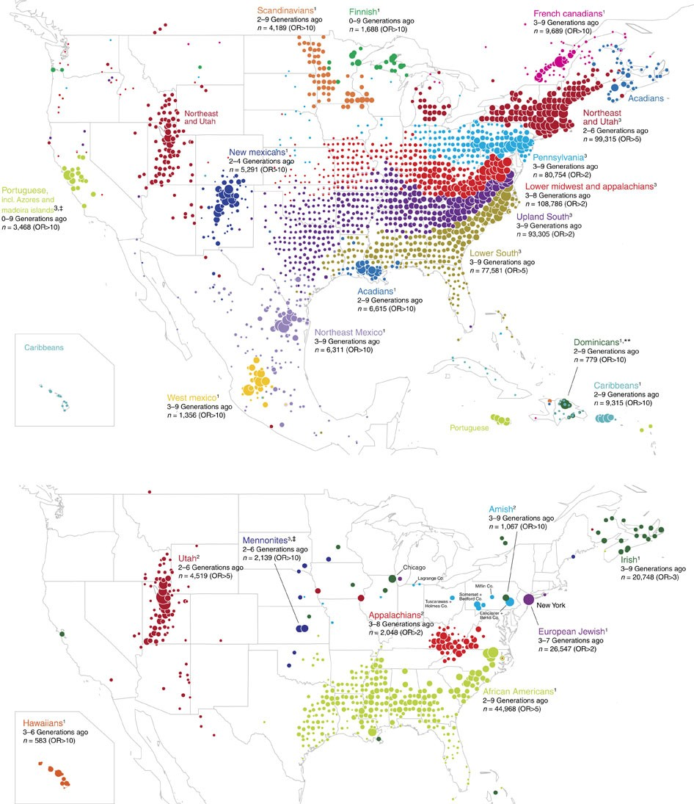

```{r, include = FALSE}
knitr::opts_chunk$set(
  collapse = TRUE,
  comment = "#>"
)
```

In psychological studies, decades of analyses of data originating from primarily Western, Educated, Industrial, Rich and Democratic (WEIRD) societies have contributed to the lack of replicability and generalizability of findings ([Henrich et al., 2010](https://www.cambridge.org/core/journals/behavioral-and-brain-sciences/article/abs/weirdest-people-inthe-world/BF84F7517D56AFF7B7EB58411A554C17)). This has motivated the development of metrics that quantify meaningful cultural differences between societies ([Muthukrishna et al., 2020](https://journals.sagepub.com/doi/full/10.1177/0956797620916782)), which bear on the validity of porting results obtained from analyzing one population over to another different population. 

<p style="text-align:center;">

</p>
<p align="center">
*2D [non-metric multidimensional scaling (NMDS)](https://www.jstor.org/stable/2110441?seq=1) plot generated from a distance matrix summarising how culturally distinct regions are. Each entry of the distance matrix reports the cultural fixation index ($\text{CF}_{ST}$) between two regions. Also shown are distances within the regions, which capture within-nation variation. Figure reproduced from [Muthukrishna et al. (2020)](https://journals.sagepub.com/doi/full/10.1177/0956797620916782), with permission from Michael Muthukrishna.* 
</p>

In contrast to between-society differences that reflect important cultural heterogeneities, differences within putatively singular populations or societies could suggest the presence of distinct communities that reflect meaningful sociological or demographic characteristics. For example, it is known that genealogical communities exist within the United States, and the persistence of homogamous mating in such communities (the determinants of which include, some scholars have suggested, geographic isolation and homophilous sorting by transmitted cultural traits; see [Kalmijn, 1998](https://www.jstor.org/stable/223487?seq=1) and [Feldman and Cavalli-Sforza, 1981](https://press.princeton.edu/books/paperback/9780691082837/cultural-transmission-and-evolution-mpb-16-volume-16)) is manifested in genetic differences ([Han et al., 2017](https://www.nature.com/articles/ncomms14238)). See the caption in the Figure below and pay attention to the French Canadians, the Amish, the New Mexicans and the Scandinavians. 
<p style="text-align:center;">

</p>
<p align="center">
*Distribution of ancestral birth locations in North America associated with clusters of individuals. A higher odds ratio (OR) implies that most present-day descendants of individuals from that ancestral birth location belong to the same cluster. Figure reproduced from [Han et al. (2017)](https://www.nature.com/articles/ncomms14238) under the Creative Commons Attribution (CC-BY) license.* 
</p>

📖 In this vignette, we will:

- show how **flinty** can be used to provide evidence for the presence of distinct subpopulations within a single-population sample of individual responses to survey questionnaires,
- demonstrate how **flinty** can generate exchangeable subsamples of individual "culturomes", in the absence of labels on the individuals.

# World Values Survey Data

We obtain publicly available survey questionnaire response data from the [World Values Survey (WVS)](https://www.worldvaluessurvey.org/wvs.jsp). The WVS is a research program aimed at understanding how beliefs, values and norms change over time and across nations globally; it is the largest non-commercial, cross-national, and time-series survey of public attitudes and values around the world. Motivated by the question of within-society differences, we focus on interrogating the cultural homogeneity of Singaporeans based on a representative collection of responses to the WVS questionnaire. To illustrate our method we use data from Wave 6 of the WVS that was released in 2012. (A report by [Mathew, Teo, Tay and Wang, 2021](https://lkyspp.nus.edu.sg/docs/default-source/ips/ips-exchange-series-17.pdf) analyzing Singaporeans from 2020's Wave 7 of the WVS has been published by the Institute of Policy Studies; here is a [press release](https://lkyspp.nus.edu.sg/ips/news/details/attitudes-towards-institutions-politics-and-policies-key-findings-from-the-world-value-survey).)  

The code below loads and describes the WVS data *before* running data processing steps.

```{r wvs_1, echo = TRUE, eval = TRUE, warning = FALSE, message = FALSE}
## Load packages
library(tidyverse)

## Load the data
## This file can be downloaded with registration from the WVS website
wvs <- readRDS("ex_data/WVS/F00007762-WV6_Data_R_v20180912.Rds")

# How many samples and how many features?
dim(wvs)

# Show the wvs tibble before processing...
wvs

# What doe each feature correspond to? 
feature_anno <- wvs %>% map_chr(~attributes(.)$label) 
head(feature_anno)

# What are the labels  (i.e., categories) attached to feature V2?
# [!] Numbers do not indicate the number of samples with that label in the full dataset
attr(wvs$V2, "labels")
```

## Data Processing

We mirror the approach taken by Muthukrishna et al. (2020) --- itself built on the work of [Bell, Richerson and McElreath (2009)](https://doi.org/10.1073/pnas.0903232106) --- to include only a subset of the questions as features and to recode responses to those questions. Concretely, we

1. Remove questions exploring personal idiosyncrasies rather than cultural beliefs (e.g., self-reported state of health is discarded);   
2. Recode by pooling similar responses into a single numerical categorical response (e.g., "very important" and "rather important" are pooled);
3. One-hot encode the resulting categorical responses.

<details>
  <summary><b>Not enough details for you?</b></summary>
    Good. Regarding Step 2 (recoding by pooling), you may download the code book [here](https://michael.muthukrishna.com/cultural-distance-data/). The authors have also developed a [Cultural Distance Web App](http://culturaldistance.com/) that you can use to explore cultural distances if you are interested.</br></br>
    Regarding Step 3 (one-hot encoding), as an example we consider the variable. After recoding there are three categories, 0, 1 and 2. Since differences between categories 0, 1 and 2 are not assumed to depend on the choice of categories, we transform 0, 1 and 2 into $3$-bits 100, 010 and 001, so that when computing Hamming distances between the categories, differences between categories are agnostic to the categories themselves. 
</details>

To facilitate our presentation, we have saved data generated from performing Steps 1 and 2 above. Below is code to load and preview this saved file.

```{r wvs_2, echo = TRUE, eval = TRUE, warning = FALSE, message = FALSE}
## Load the data 
load("ex_data/WVS/all_MM_num_filtered_recode.RData")

## View data
wv_num_filtered_[1:10, 1:10]
```

As a final step, we restrict our samples to individuals from Singapore. 

```{r wvs_3, echo = TRUE, eval = TRUE, warning = FALSE, message = FALSE}
## Select individuals from Singapore
wv_filtered_sg <- wv_num_filtered_ %>% 
  filter(`Country Code` == "Singapore") %>%
  select_if(function(x) !(all(is.na(x)))) %>%
  remove_missing() %>% 
  mutate(across(where(is.numeric), as.factor))

## View data
wv_filtered_sg[1:10, 1:10]

## Get data dimensions
dim(wv_filtered_sg)
```
